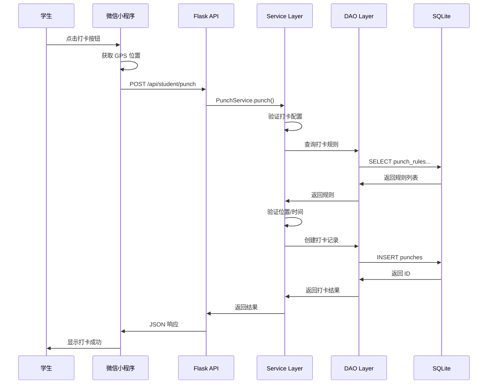
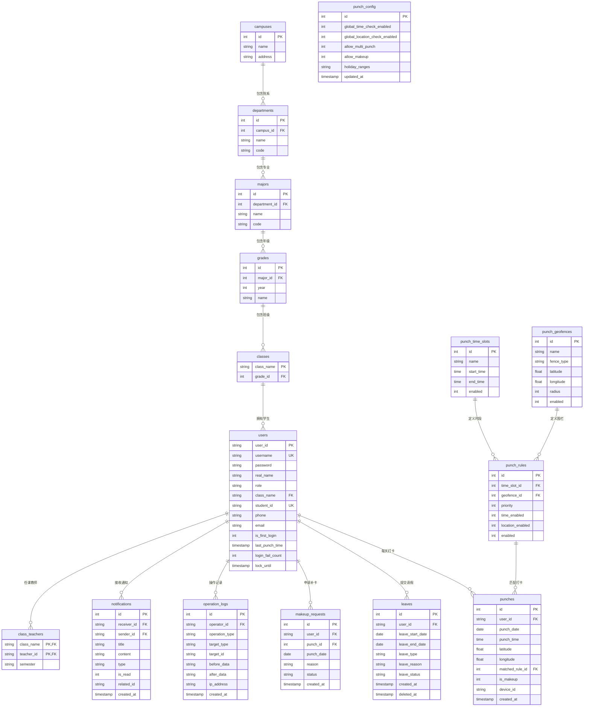

# 微信小程序班级考勤系统

基于微信小程序的班级考勤打卡系统，支持学生打卡、教师管理、班委统计、请假审批以及位置范围打卡功能。

## 项目简介

本项目是一个完整的班级考勤解决方案，使用微信小程序作为前端，Flask后端提供API服务，SQLite数据库存储数据。系统支持多种角色登录、地理位置范围打卡、请假审批等功能。

### 核心特点

- **多角色支持**：学生、教师、班委、管理员四种角色
- **JWT认证**：安全的Token认证机制，支持基于角色的权限控制
- **位置打卡**：支持设置打卡位置范围，学生必须在范围内才能打卡成功
- **请假审批**：完整的请假申请和审批流程
- **补卡申请**：支持学生提交补卡申请，教师审批
- **主题切换**：支持多主题切换，适配不同用户偏好
- **Web管理后台**：管理员可通过浏览器管理用户和考勤记录
- **密码安全**：密码使用bcrypt哈希存储

---

## 系统架构

### 架构概览

```mermaid
flowchart TB
    subgraph Frontend["微信小程序前端"]
        Login["登录页面"]
        StudentPages["学生页面"]
        TeacherPages["教师页面"]
        AdminWeb["管理员Web界面"]
    end

    subgraph Backend["Flask 后端 API"]
        subgraph Routes["Routes 层"]
            auth_bp["auth_bp<br/>/api"]
            student_bp["student_bp<br/>/api/student"]
            teacher_bp["teacher_bp<br/>/api/teacher"]
            admin_bp["admin_bp<br/>/api/admin"]
            common_bp["common_bp<br/>/api"]
        end

        subgraph Services["Service 层"]
            Auth["AuthService"]
            Punch["PunchService"]
            Leave["LeaveService"]
            Makeup["MakeupService"]
            Teacher["TeacherService"]
            Admin["AdminService"]
            Log["LogService"]
            Notification["NotificationService"]
        end

        subgraph DAO["DAO 层"]
            UserDAO["UserDAO"]
            PunchDAO["PunchDAO"]
            LeaveDAO["LeaveDAO"]
            MakeupDAO["MakeupDAO"]
            ConfigDAO["ConfigDAO"]
        end
    end

    subgraph Database["SQLite 数据库"]
        DB[("users<br/>punches<br/>leaves<br/>makeup_requests<br/>punch_rules<br/>...")]
    end

    Frontend -->|HTTP/JWT| Routes
    Routes --> Services
    Services --> DAO
    DAO --> Database
```



### 数据流处理



---

## 项目结构

```mermaid
graph TD
    class-checkin-wxapp["class-checkin-wxapp/"]

    class-checkin-wxapp --> backend["backend/"]
    class-checkin-wxapp --> miniprogram["miniprogram/"]
    class-checkin-wxapp --> docs["docs/"]

    backend --> app_py["app.py"]
    backend --> config_py["config.py"]
    backend --> db_connection_py["db_connection.py"]

    backend --> routes["routes/"]
    routes --> routes_init["__init__.py"]
    routes --> auth_py["auth.py"]
    routes --> student_py["student.py"]
    routes --> teacher_py["teacher.py"]
    routes --> admin_py["admin.py"]
    routes --> common_py["common.py"]

    backend --> services["services/"]
    services --> auth_service["auth_service.py"]
    services --> punch_service["punch_service.py"]
    services --> leave_service["leave_service.py"]
    services --> makeup_service["makeup_service.py"]
    services --> teacher_service["teacher_service.py"]
    services --> admin_service["admin_service.py"]
    services --> log_service["log_service.py"]
    services --> notification_service["notification_service.py"]
    services --> config_service["config_service.py"]
    services --> statistics_service["statistics_service.py"]

    backend --> dao["dao/"]
    dao --> base_dao["base_dao.py"]
    dao --> user_dao["user_dao.py"]
    dao --> punch_dao["punch_dao.py"]
    dao --> leave_dao["leave_dao.py"]
    dao --> makeup_dao["makeup_request_dao.py"]
    dao --> geofence_dao["punch_geofence_dao.py"]
    dao --> config_dao["punch_config_dao.py"]

    backend --> models["models/"]
    backend --> utils["utils/"]
    utils --> auth_utils["auth.py"]
    utils --> geo_utils["geo.py"]
    utils --> exceptions["exceptions.py"]

    backend --> db["db/"]
    db --> schema["schema/"]

    miniprogram --> pages["pages/"]
    pages --> login["login/"]
    pages --> student["student/"]
    pages --> teacher["teacher/"]

    docs --> api_doc["api_doc.md"]
    docs --> routes_plan["routes_layer_plan.md"]

    class routes/completed fill:#90EE90
    class services/completed fill:#90EE90
    class dao/completed fill:#90EE90
```

---

## 统一响应格式

### 成功响应
```json
{
    "code": 200,
    "message": "success",
    "data": { ... }
}
```

### 错误响应
```json
{
    "code": <错误码>,
    "message": "<错误描述>"
}
```

---

## API 接口概览

### 认证接口 (`/api`)
| 方法 | 路径 | 说明 | 认证 |
|------|------|------|------|
| POST | /login | 用户登录 | 否 |
| POST | /change-password | 修改密码 | 是 |
| GET | /current-user | 获取当前用户 | 是 |

### 学生接口 (`/api/student`)
| 方法 | 路径 | 说明 | 角色 |
|------|------|------|------|
| POST | /punch | 打卡 | student, monitor |
| GET | /punch-records | 打卡记录 | student, monitor |
| POST | /leave/apply | 请假申请 | student, monitor |
| GET | /leave/records | 请假记录 | student, monitor |
| POST | /makeup/apply | 补卡申请 | student, monitor |
| GET | /makeup/records | 补卡记录 | student, monitor |
| GET | /notifications | 通知列表 | student, monitor |

### 教师接口 (`/api/teacher`)
| 方法 | 路径 | 说明 | 角色 |
|------|------|------|------|
| GET | /classes | 班级列表 | teacher |
| GET | /class/students | 学生列表 | teacher |
| GET | /class/punch-summary | 打卡汇总 | teacher |
| GET | /leave/pending | 待审批请假 | teacher |
| POST | /leave/approve | 审批请假 | teacher |
| GET | /makeup/pending | 待审批补卡 | teacher |
| POST | /makeup/approve | 审批补卡 | teacher |
| POST | /monitor/appoint | 任命班委 | teacher |
| DELETE | /monitor/remove | 撤销班委 | teacher |

### 管理员接口 (`/api/admin`)
| 方法 | 路径 | 说明 | 角色 |
|------|------|------|------|
| GET | /users | 用户列表 | admin |
| POST | /users | 创建用户 | admin |
| PUT | /users/<user_id> | 更新用户 | admin |
| DELETE | /users/<user_id> | 删除用户 | admin |
| POST | /users/reset-password | 重置密码 | admin |
| GET | /attendance-records | 考勤记录 | admin |
| POST | /attendance-records | 创建考勤记录 | admin |
| GET | /punch-location | 打卡位置 | admin |
| POST | /punch-location | 设置打卡位置 | admin |
| GET | /config | 全局配置 | admin |
| PUT | /config | 更新配置 | admin |

### 通用接口 (`/api`)
| 方法 | 路径 | 说明 | 认证 |
|------|------|------|------|
| GET | /notifications | 通知列表 | 是 |
| POST | /notifications/mark-read | 标记已读 | 是 |
| GET | /notifications/unread-count | 未读数量 | 是 |
| GET | /operation-logs | 操作日志 | admin, teacher |

详细 API 文档请参考 [docs/api_doc.md](docs/api_doc.md)

---

## 数据库模型

### 核心数据表

| 表名 | 说明 |
|------|------|
| users | 用户表 |
| punches | 打卡记录表 |
| leaves | 请假申请表 |
| makeup_requests | 补卡申请表 |
| punch_geofences | 打卡围栏表 |
| punch_time_slots | 打卡时段表 |
| punch_rules | 打卡规则表 |
| punch_config | 打卡配置表 |
| operation_logs | 操作日志表 |
| notifications | 通知表 |
| campuses | 校区表 |
| departments | 院系表 |
| majors | 专业表 |
| grades | 年级表 |
| classes | 班级表 |
| class_teachers | 班级教师表 |

### 表关系



---

## 技术栈

| 模块 | 技术 | 说明 |
|------|------|------|
| 前端 | 微信小程序 | 用户界面、打卡操作、地图展示 |
| 后端 | Flask | RESTful API 服务 |
| 数据库 | SQLite | 轻量级关系型数据库 |
| 认证 | JWT | HS256 签名 |
| 管理后台 | HTML + JavaScript | 管理员 Web 界面 |

---

## 环境变量配置

| 配置项 | 默认值 | 说明 |
|--------|--------|------|
| `JWT_SECRET_KEY` | 必填 | JWT 密钥，生产环境必须设置 |
| `TOKEN_EXPIRE_HOURS` | 24 | Token 过期时间（小时） |
| `DATABASE_FILE` | user.db | 数据库文件路径 |
| `INSERT_TEST_DATA` | True | 是否插入测试数据 |
| `FLASK_HOST` | 0.0.0.0 | Flask 服务器主机地址 |
| `FLASK_PORT` | 5000 | Flask 服务器端口 |
| `FLASK_DEBUG` | True | Flask 调试模式 |
| `RANDOM_PASSWORD_LENGTH` | 8 | 重置密码长度 |
| `PUNCH_RECORDS_LIMIT` | 30 | 打卡记录查询限制 |

---

## Service 层完成状态

| 模块 | 状态 | 说明 |
|------|-------|------|
| **AuthService** | ✅ 完成 | 登录认证、密码修改、账户锁定 |
| **PunchService** | ✅ 完成 | 打卡、位置验证、记录查询（含分页） |
| **LeaveService** | ✅ 完成 | 请假申请、审批 |
| **MakeupService** | ✅ 完成 | 补卡申请、审批 |
| **TeacherService** | ✅ 完成 | 班级管理、班委管理 |
| **AdminService** | ✅ 完成 | 用户管理、考勤管理（含数据库分页） |
| **LogService** | ✅ 完成 | 操作日志记录和查询 |
| **NotificationService** | ✅ 完成 | 通知发送和管理 |
| **ConfigService** | ✅ 完成 | 打卡规则配置 |
| **StatisticsService** | ✅ 完成 | 考勤统计和预警 |

---

## 功能列表

### 1. 登录认证
- 支持学生、教师、班委、管理员四种角色
- 学号/工号 + 密码登录
- 登录成功后自动存储用户信息和 JWT 令牌
- 登录输入长度验证（账户 6-12 位，密码 6-20 位）
- 错误信息模糊化处理，防止信息泄露

### 2. 学生功能
- **打卡签到**：一键打卡，自动获取当前位置
- **位置验证**：必须在管理员设置的范围内才能打卡成功
- **请假申请**：提交请假开始和结束日期
- **补卡申请**：可申请近 3 天内的补卡
- **打卡记录**：查看历史打卡记录（支持分页筛选）
- **请假记录**：查看请假申请状态
- **补卡记录**：查看补卡申请状态
- **通知查看**：查看系统通知

### 3. 教师功能
- **班级列表**：获取所教班级列表
- **班级学生**：查看班级学生及打卡状态
- **打卡汇总**：查看班级当日打卡汇总
- **班委任命**：任命学生为班委
- **班委移除**：移除学生班委职务
- **请假审批**：查看并审批学生请假申请
- **补卡审批**：查看并审批学生补卡申请

### 4. 管理员功能
- **用户管理**：添加、修改、删除用户（支持数据库分页）
- **考勤记录管理**：查看、添加、修改、删除考勤记录
- **打卡位置配置**：设置打卡位置（名称、经纬度、半径）
- **全局配置**：打卡开关、假期配置等
- **考勤筛选**：按用户名、用户 ID、日期范围、请假状态筛选

### 5. 通用功能
- **通知管理**：查看通知、标记已读、未读数量
- **操作日志**：查看操作日志（支持多条件筛选）

---

## 快速开始

### 1. 环境要求

- Python 3.7+
- 微信开发者工具

### 2. 后端部署

```bash
# 进入后端目录
cd backend

# 安装依赖
pip install -r requirements.txt

# 配置环境变量（可选，使用默认值可跳过）
cp .env.example .env
# 编辑 .env 文件修改配置

# 启动服务
python app.py
```

后端服务启动后：
- API 服务：http://localhost:5000/api
- 管理后台：http://localhost:5000/admin

### 3. 测试账户

| 角色 | 用户ID | 用户名 | 密码 |
|------|--------|--------|------|
| 管理员 | admin001 | admin | admin123 |
| 教师 | T2024001 | zhang_teacher | 123456 |
| 教师 | T2024002 | li_teacher | 123456 |
| 学生 | S2024001 | zhang_student | 123456 |
| 学生 | S2024002 | li_student | 123456 |
| 班委 | S2024003 | wang_student | 123456 |
| 学生 | S2024004 | zhao_student | 123456 |
| 学生 | S2024005 | qian_student | 123456 |

---

## 安全特性

1. **JWT 认证**：所有敏感 API 都需要携带有效的 JWT Token
2. **角色权限控制**：使用 `@token_required` 和 `@role_required` 装饰器进行权限验证
3. **密码安全存储**：密码使用 bcrypt 哈希存储
4. **输入验证**：登录输入长度限制（账户 6-12 位，密码 6-20 位）
5. **错误信息模糊化**：防止通过错误信息推断用户存在性
6. **管理员保护**：防止删除最后一个管理员账户
7. **SQL 注入防护**：BaseDAO 层实现表名白名单和参数验证
8. **账户锁定**：连续 5 次登录失败，锁定账户 1 小时

---

## 项目进度

### ✅ 已完成

- [x] 路由层重构（Routes Layer）
- [x] Service 层重构（Service Layer）
- [x] DAO 层重构（DAO Layer）
- [x] 统一响应格式
- [x] 权限装饰器增强
- [x] 数据库分页支持
- [x] API 接口文档

### 📋 文档

- [API 接口文档](docs/api_doc.md)
- [路由层重构计划](docs/routes_layer_plan.md)
- [服务层重构计划](docs/service_layer_plan.md)

---

## 许可证

MIT License

---

欢迎使用微信小程序班级考勤系统！
