# 微信小程序班级考勤系统

基于微信小程序的班级考勤打卡系统，支持学生打卡、教师管理、班委统计、请假审批以及位置范围打卡功能。

## 项目简介

本项目是一个完整的班级考勤解决方案，使用微信小程序作为前端，Flask后端提供API服务，SQLite数据库存储数据。系统支持多种角色登录、地理位置范围打卡、请假审批等功能。

### 核心特点

- **多角色支持**：学生、教师、班委、管理员四种角色
- **JWT认证**：安全的Token认证机制，支持基于角色的权限控制
- **位置打卡**：支持设置打卡位置范围，学生必须在范围内才能打卡成功
- **请假审批**：完整的请假申请和审批流程
- **主题切换**：支持多主题切换，适配不同用户偏好
- **Web管理后台**：管理员可通过浏览器管理用户和考勤记录
- **密码安全**：密码使用bcrypt哈希存储

---

## 系统架构

### 架构概览

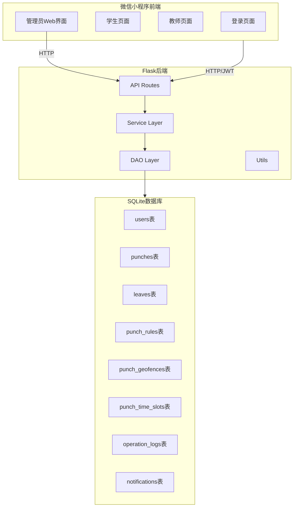
```mermaid
flowchart TB
    subgraph Frontend["微信小程序前端"]
        Login["登录页面"]
        StudentPages["学生页面"]
        TeacherPages["教师页面"]
        AdminWeb["管理员Web界面"]
    end

    subgraph Backend["Flask后端"]
        Routes["API Routes"]
        Services["Service Layer"]
        DAO["DAO Layer"]
        Utils["Utils"]
    end

    subgraph Database["SQLite数据库"]
        Users["users表"]
        Punches["punches表"]
        Leaves["leaves表"]
        Rules["punch_rules表"]
        Geofences["punch_geofences表"]
        TimeSlots["punch_time_slots表"]
        Logs["operation_logs表"]
        Notifications["notifications表"]
    end

    Frontend -->|HTTP/JWT| Routes
    Routes --> Services
    Services --> DAO
    DAO --> Database

    AdminWeb -->|HTTP| Routes
```

### 数据流处理

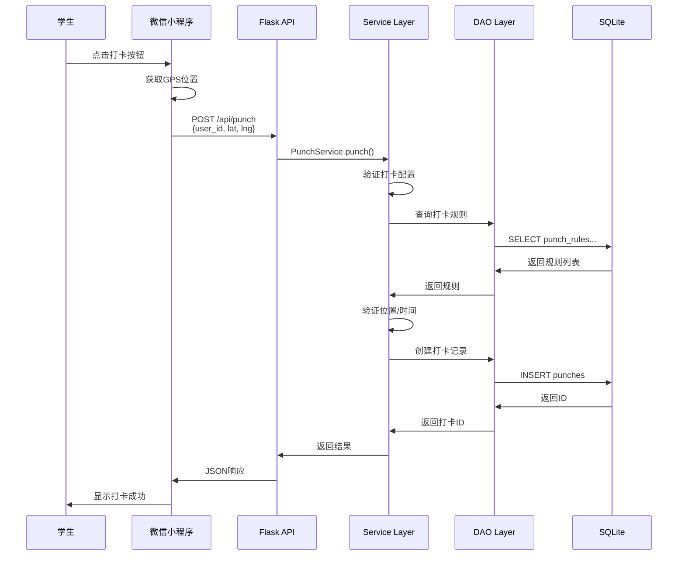
```mermaid
sequenceDiagram
    participant Student as 学生
    participant MiniApp as 微信小程序
    participant API as Flask API
    participant Service as Service Layer
    participant DAO as DAO Layer
    participant DB as SQLite

    Student->>MiniApp: 点击打卡按钮
    MiniApp->>MiniApp: 获取GPS位置
    MiniApp->>API: POST /api/punch<br/>{user_id, lat, lng}
    API->>Service: PunchService.punch()
    Service->>Service: 验证打卡配置
    Service->>DAO: 查询打卡规则
    DAO->>DB: SELECT punch_rules...
    DB->>DAO: 返回规则列表
    DAO->>Service: 返回规则
    Service->>Service: 验证位置/时间
    Service->>DAO: 创建打卡记录
    DAO->>DB: INSERT punches
    DB->>DAO: 返回ID
    DAO->>Service: 返回打卡ID
    Service->>API: 返回结果
    API->>MiniApp: JSON响应
    MiniApp->>Student: 显示打卡成功
```

---

## 项目结构


```mermaid
graph TD
    Root["class-checkin-wxapp/"]
    Backend["backend/"]
    Frontend["miniprogram/"]

    Root --> Backend
    Root --> Frontend

    Backend --> Config["config.py"]
    Backend --> App["app.py"]
    Backend --> DBConn["db_connection.py"]
    Backend --> InitDB["init_db.py"]

    Backend --> Routes["routes/"]
    Routes --> LoginR["login.py"]
    Routes --> StudentR["students.py"]
    Routes --> TeacherR["teachers.py"]
    Routes --> AdminR["admin.py"]

    Backend --> Services["services/"]
    Services --> AuthSvc["auth_service.py"]
    Services --> PunchSvc["punch_service.py"]
    Services --> LeaveSvc["leave_service.py"]
    Services --> TeacherSvc["teacher_service.py"]
    Services --> AdminSvc["admin_service.py"]
    Services --> LogSvc["log_service.py"]:::completed
    Services --> NotifSvc["notification_service.py"]:::completed

    Backend --> DAO["dao/"]
    DAO --> BaseDAO["base_dao.py"]
    DAO --> UserDAO["user_dao.py"]
    DAO --> PunchDAO["punch_dao.py"]
    DAO --> LeaveDAO["leave_dao.py"]
    DAO --> RuleDAO["punch_rule_dao.py"]
    DAO --> GeofenceDAO["punch_geofence_dao.py"]
    DAO --> TimeSlotDAO["punch_time_slot_dao.py"]
    DAO --> OpLogDAO["operation_log_dao.py"]
    DAO --> NotifDAO["notification_dao.py"]
    DAO --> ConfigDAO["punch_config_dao.py"]

    Backend --> Utils["utils/"]
    Utils --> Auth["auth.py"]
    Utils --> Geo["geo.py"]
    Utils --> Exceptions["exceptions.py"]

    Backend --> Models["models/"]
    Models --> UserM["user.py"]
    Models --> PunchM["punch.py"]
    Models --> LeaveM["leave.py"]
    Models --> RuleM["punch_rule.py"]
    Models --> GeofenceM["punch_geofence.py"]
    Models --> NotifM["notification.py"]

    Backend --> DB["db/"]
    DB --> Schema["schema/"]
    DB --> Init["init_db.py"]

    Frontend --> Pages["pages/"]
    Frontend --> Components["components/"]
    Frontend --> ConfigF["config/"]

    classDef completed fill:#90EE90
```

---

## 数据库模型

### 数据表关系

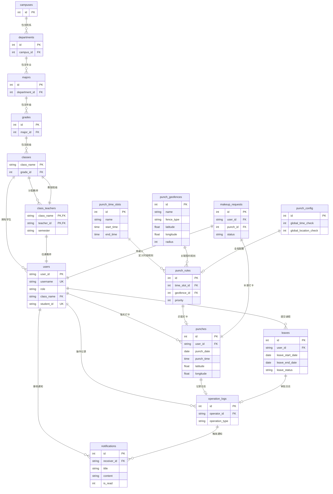
```mermaid
erDiagram
    users ||--o{ punches : "每天打卡"
    users ||--o{ leaves : "提交请假"
    users ||--o{ operation_logs : "操作记录"
    users ||--o{ notifications : "接收通知"
    users {
        string user_id PK
        string username UK
        string role
        string class_name FK
        string student_id UK
    }

    classes ||--o{ users : "拥有学生"
    classes ||--o{ class_teachers : "分配教师"
    classes {
        string class_name PK
        int grade_id FK
    }

    grades ||--o{ classes : "包含班级"
    grades {
        int id PK
        int major_id FK
    }

    majors ||--o{ grades : "包含年级"
    majors {
        int id PK
        int department_id FK
    }

    departments ||--o{ majors : "包含专业"
    departments {
        int id PK
        int campus_id FK
    }

    campuses ||--o{ departments : "包含院系"
    campuses {
        int id PK
    }

    class_teachers ||--|| classes : "教授班级"
    class_teachers ||--|| users : "任课教师"
    class_teachers {
        string class_name PK,FK
        string teacher_id PK,FK
        string semester
    }

    punch_time_slots ||--o{ punch_rules : "定义时段规则"
    punch_time_slots {
        int id PK
        string name
        time start_time
        time end_time
    }

    punch_geofences ||--o{ punch_rules : "关联围栏规则"
    punch_geofences {
        int id PK
        string name
        string fence_type
        float latitude
        float longitude
        int radius
    }

    punch_rules ||--o| punches : "匹配打卡"
    punch_rules {
        int id PK
        int time_slot_id FK
        int geofence_id FK
        int priority
    }

    punches ||--o| operation_logs : "记录日志"
    punches {
        int id PK
        string user_id FK
        date punch_date
        time punch_time
        float latitude
        float longitude
    }

    leaves ||--o| operation_logs : "审批日志"
    leaves {
        int id PK
        string user_id FK
        date leave_start_date
        date leave_end_date
        string leave_status
    }

    makeup_requests ||--|| users : "申请人"
    makeup_requests ||--|| punches : "补录打卡"
    makeup_requests {
        int id PK
        string user_id FK
        int punch_id FK
        string status
    }

    punch_config ||--o| punch_rules : "全局配置"
    punch_config {
        int id PK
        int global_time_check
        int global_location_check
    }

    operation_logs ||--o{ notifications : "触发通知"
    operation_logs {
        int id PK
        string operator_id FK
        string operation_type
    }

    notifications {
        int id PK
        string receiver_id FK
        string title
        string content
        int is_read
    }
```

### 核心数据表

#### users - 用户表

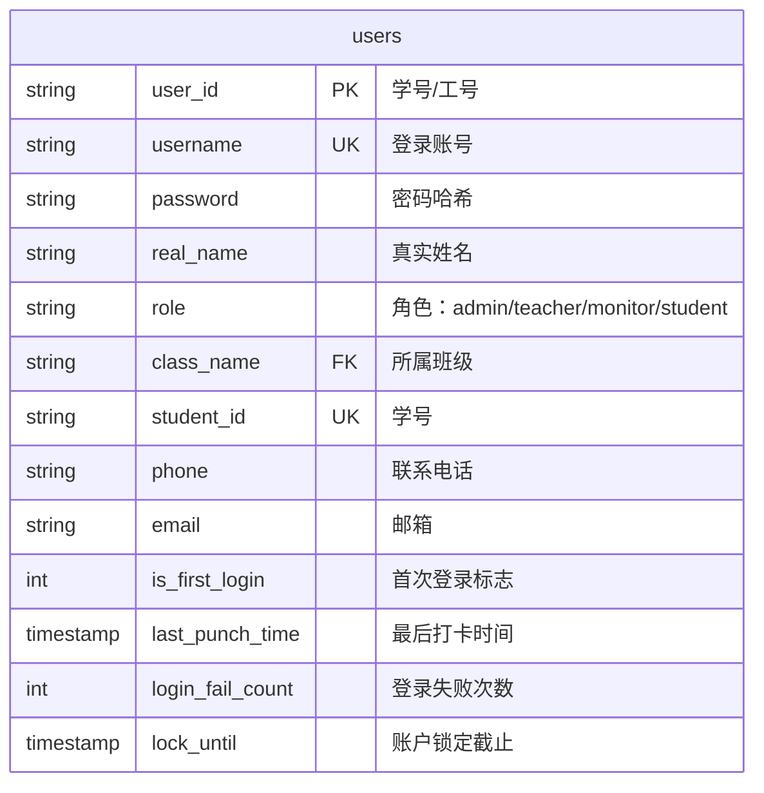
```mermaid
erDiagram
    users {
        string user_id PK "学号/工号"
        string username UK "登录账号"
        string password "密码哈希"
        string real_name "真实姓名"
        string role "角色：admin/teacher/monitor/student"
        string class_name FK "所属班级"
        string student_id UK "学号"
        string phone "联系电话"
        string email "邮箱"
        int is_first_login "首次登录标志"
        timestamp last_punch_time "最后打卡时间"
        int login_fail_count "登录失败次数"
        timestamp lock_until "账户锁定截止"
    }
```

#### punches - 打卡记录表

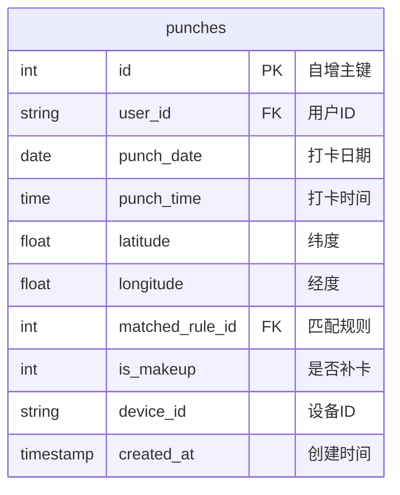
```mermaid
erDiagram
    punches {
        int id PK "自增主键"
        string user_id FK "用户ID"
        date punch_date "打卡日期"
        time punch_time "打卡时间"
        float latitude "纬度"
        float longitude "经度"
        int matched_rule_id FK "匹配规则"
        int is_makeup "是否补卡"
        string device_id "设备ID"
        timestamp created_at "创建时间"
    }
```

---

## 技术架构

| 模块 | 技术栈 | 说明 |
|------|--------|------|
| 前端 | 微信小程序原生开发 | 用户界面、打卡操作、地图展示 |
| 后端 | Flask + Flask-CORS | RESTful API服务 |
| 数据库 | SQLite | 轻量级关系型数据库 |
| 管理后台 | HTML + JavaScript | 管理员Web界面 |

---

## 环境变量配置

| 配置项 | 默认值 | 说明 |
|--------|--------|------|
| `JWT_SECRET_KEY` | 必填 | JWT密钥，生产环境必须设置 |
| `TOKEN_EXPIRE_HOURS` | 24 | Token过期时间（小时） |
| `DATABASE_FILE` | user.db | 数据库文件路径 |
| `INSERT_TEST_DATA` | True | 是否插入测试数据 |
| `FLASK_HOST` | 0.0.0.0 | Flask服务器主机地址 |
| `FLASK_PORT` | 5000 | Flask服务器端口 |
| `FLASK_DEBUG` | True | Flask调试模式 |
| `RANDOM_PASSWORD_LENGTH` | 8 | 重置密码长度 |
| `PUNCH_RECORDS_LIMIT` | 30 | 打卡记录查询限制 |

---

## 重构进度

### 重构概览

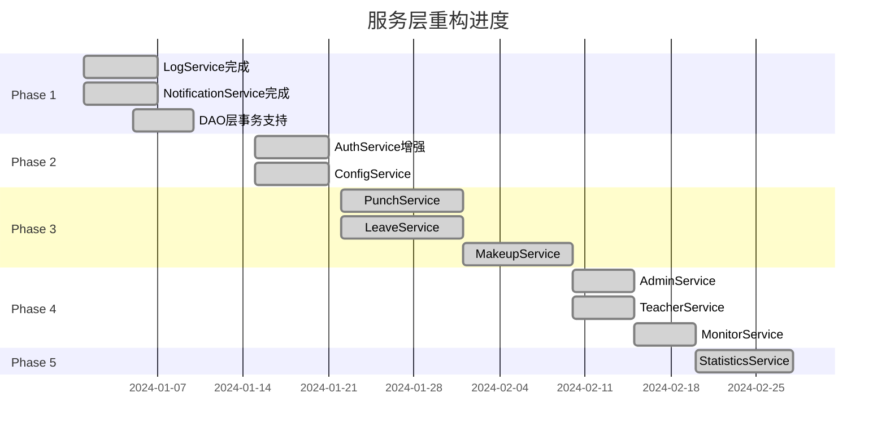
```mermaid
gantt
    title 服务层重构进度
    dateFormat YYYY-MM-DD
    section Phase 1
    LogService完成          :done, 2024-01-01, 2024-01-07
    NotificationService完成  :done, 2024-01-01, 2024-01-07
    DAO层事务支持           :done, 2024-01-05, 2024-01-10
    section Phase 2
    AuthService增强         :done, 2024-01-15, 2024-01-21
    ConfigService          :done, 2024-01-15, 2024-01-21
    section Phase 3
    PunchService           :done, 2024-01-22, 2024-02-01
    LeaveService           :done, 2024-01-22, 2024-02-01
    MakeupService          :done, 2024-02-01, 2024-02-10
    section Phase 4
    AdminService           :done, 2024-02-10, 2024-02-15
    TeacherService          :done, 2024-02-10, 2024-02-15
    MonitorService         :done, 2024-02-15, 2024-02-20
    section Phase 5
    StatisticsService      :done, 2024-02-20, 2024-02-28
```

### 当前状态

| 模块 | 状态 | 说明 |
|------|-------|------|
| **LogService** | ✅ 已完成 | 操作日志记录和查询 |
| **NotificationService** | ✅ 已完成 | 消息通知发送和管理 |
| **BaseDAO** | ✅ 已重构 | 支持可选事务连接参数 |
| **DAO事务支持** | ✅ 已完成 | OperationLogDAO, NotificationDAO |
| **AuthService** | ✅ 已完成 | 登录锁定、首次登录处理、密码重置 |
| **ConfigService** | ✅ 已完成 | 打卡规则配置服务 |
| **PunchService** | ✅ 已完成 | 打卡功能、位置验证、记录管理 |
| **LeaveService** | ✅ 已完成 | 请假申请和审批 |
| **MakeupService** | ✅ 已完成 | 补卡申请和审批 |
| **AdminService** | ✅ 已完成 | 组织架构和用户管理 |
| **TeacherService** | ✅ 已完成 | 班级管理和审批 |
| **MonitorService** | ✅ 已完成 | 班委功能 |
| **StatisticsService** | ✅ 已完成 | 考勤统计和预警 |

### ✅ 已完成功能详情

#### LogService

**文件**: `services/log_service.py`

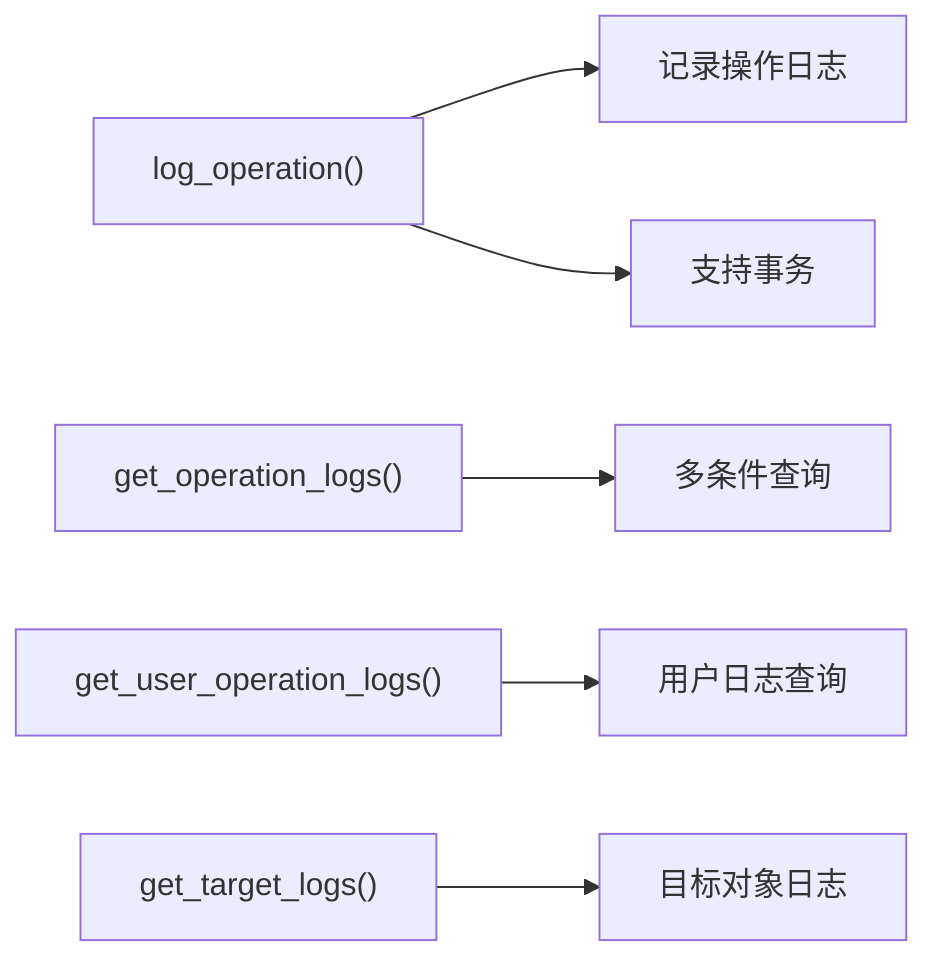
```mermaid
graph LR
    A["log_operation()"] --> B["记录操作日志"]
    A --> C["支持事务"]
    D["get_operation_logs()"] --> E["多条件查询"]
    F["get_user_operation_logs()"] --> G["用户日志查询"]
    H["get_target_logs()"] --> I["目标对象日志"]
```

#### NotificationService

**文件**: `services/notification_service.py`

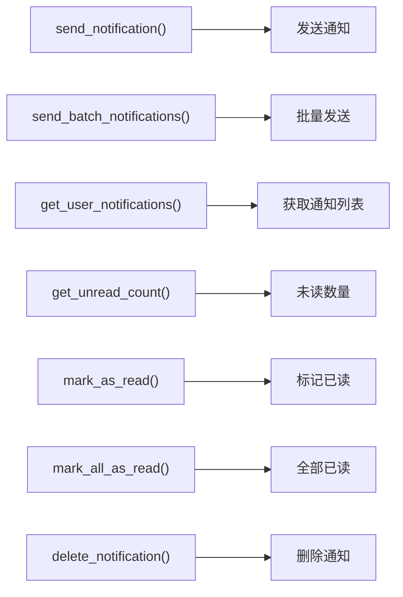
```mermaid
graph LR
    A["send_notification()"] --> B["发送通知"]
    C["send_batch_notifications()"] --> D["批量发送"]
    E["get_user_notifications()"] --> F["获取通知列表"]
    G["get_unread_count()"] --> H["未读数量"]
    I["mark_as_read()"] --> J["标记已读"]
    K["mark_all_as_read()"] --> L["全部已读"]
    M["delete_notification()"] --> N["删除通知"]
```

#### BaseDAO 重构

**改进内容**:

1. **移除硬编码**: `sqlite3.connect('class_checkin.db')` → `db_connection.get_connection()`
2. **SQL注入防护**:
   - 表名白名单验证
   - 列名正则验证
   - order_by参数安全验证

#### AuthService

**文件**: `services/auth_service.py`

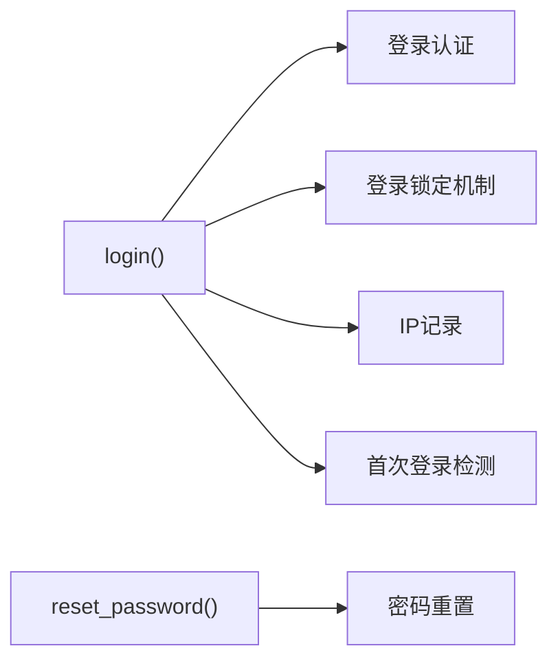
```mermaid
graph LR
    A["login()"] --> B["登录认证"]
    A --> C["登录锁定机制"]
    A --> D["IP记录"]
    E["reset_password()"] --> F["密码重置"]
    A --> G["首次登录检测"]
```

#### ConfigService

**文件**: `services/config_service.py`

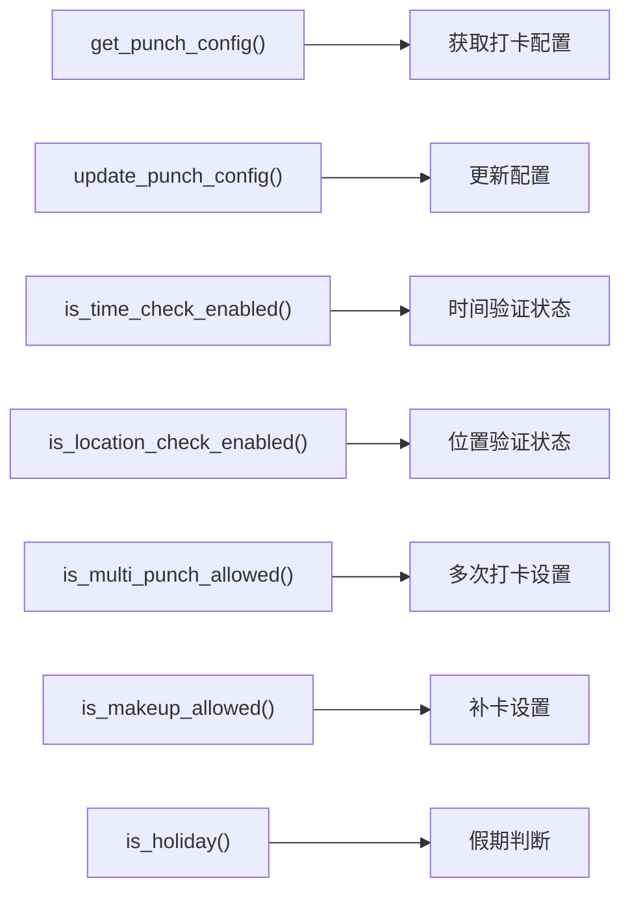
```mermaid
graph LR
    A["get_punch_config()"] --> B["获取打卡配置"]
    C["update_punch_config()"] --> D["更新配置"]
    E["is_time_check_enabled()"] --> F["时间验证状态"]
    G["is_location_check_enabled()"] --> H["位置验证状态"]
    I["is_multi_punch_allowed()"] --> J["多次打卡设置"]
    K["is_makeup_allowed()"] --> L["补卡设置"]
    M["is_holiday()"] --> N["假期判断"]
```

#### PunchService

**文件**: `services/punch_service.py`

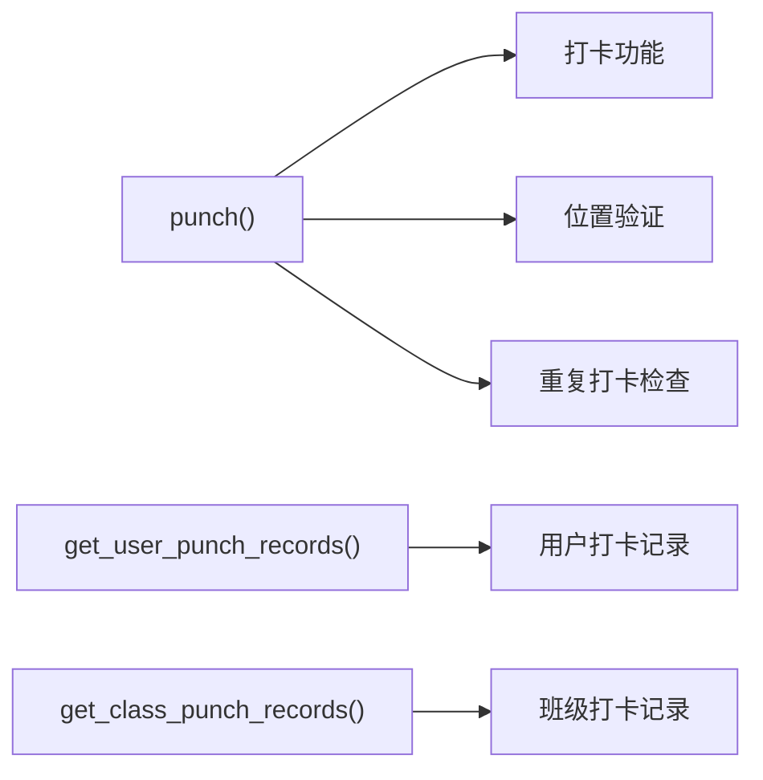
```mermaid
graph LR
    A["punch()"] --> B["打卡功能"]
    A --> C["位置验证"]
    A --> D["重复打卡检查"]
    E["get_user_punch_records()"] --> F["用户打卡记录"]
    G["get_class_punch_records()"] --> H["班级打卡记录"]
```

#### LeaveService

**文件**: `services/leave_service.py`

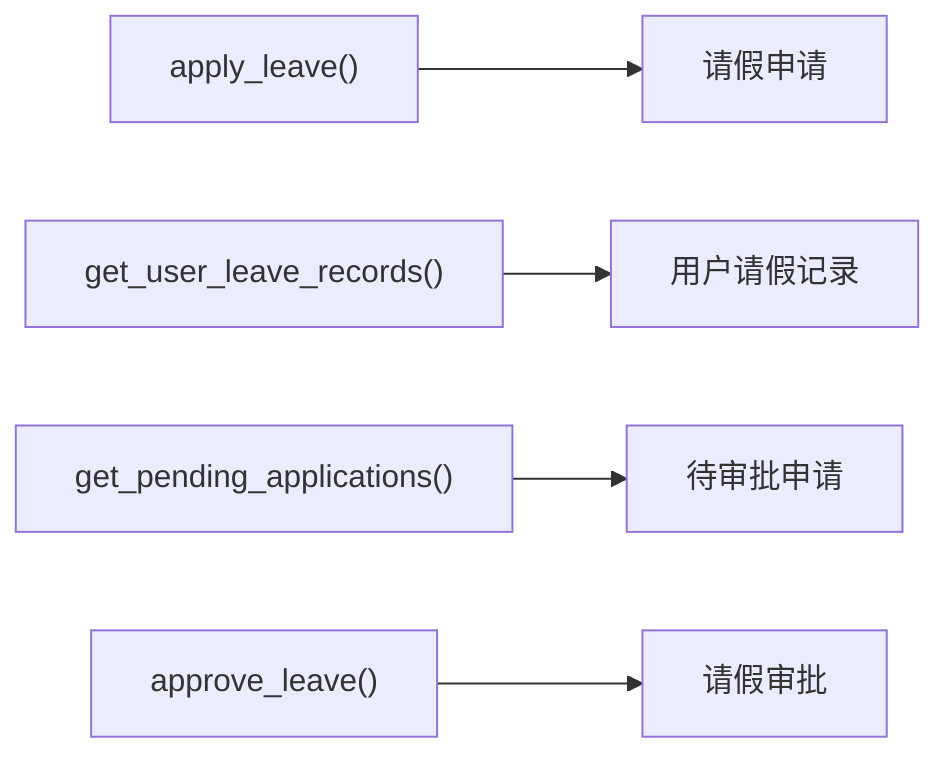
```mermaid
graph LR
    A["apply_leave()"] --> B["请假申请"]
    C["get_user_leave_records()"] --> D["用户请假记录"]
    E["get_pending_applications()"] --> F["待审批申请"]
    G["approve_leave()"] --> H["请假审批"]
```

#### MakeupService

**文件**: `services/makeup_service.py`

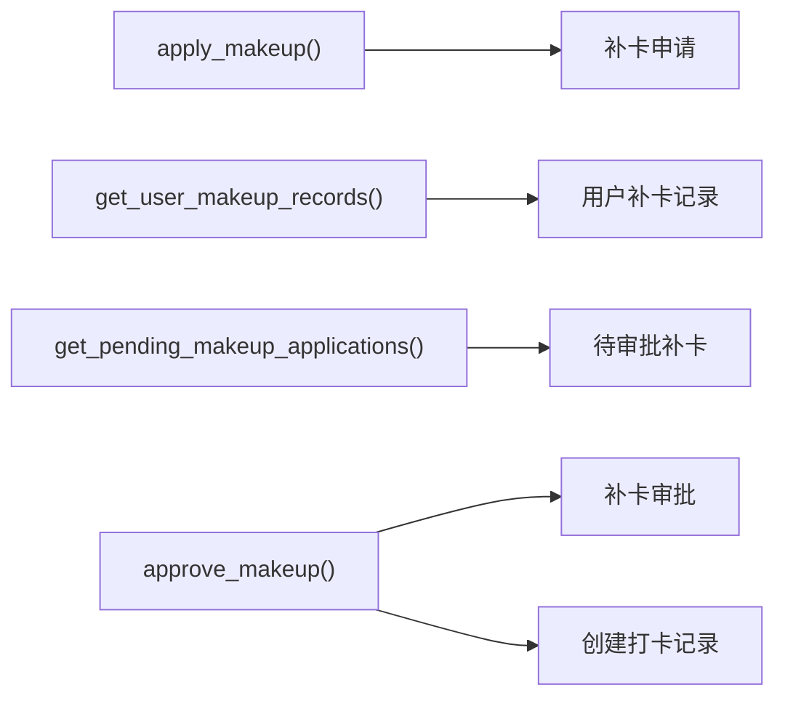
```mermaid
graph LR
    A["apply_makeup()"] --> B["补卡申请"]
    C["get_user_makeup_records()"] --> D["用户补卡记录"]
    E["get_pending_makeup_applications()"] --> F["待审批补卡"]
    G["approve_makeup()"] --> H["补卡审批"]
    G --> I["创建打卡记录"]
```

#### AdminService

**文件**: `services/admin_service.py`

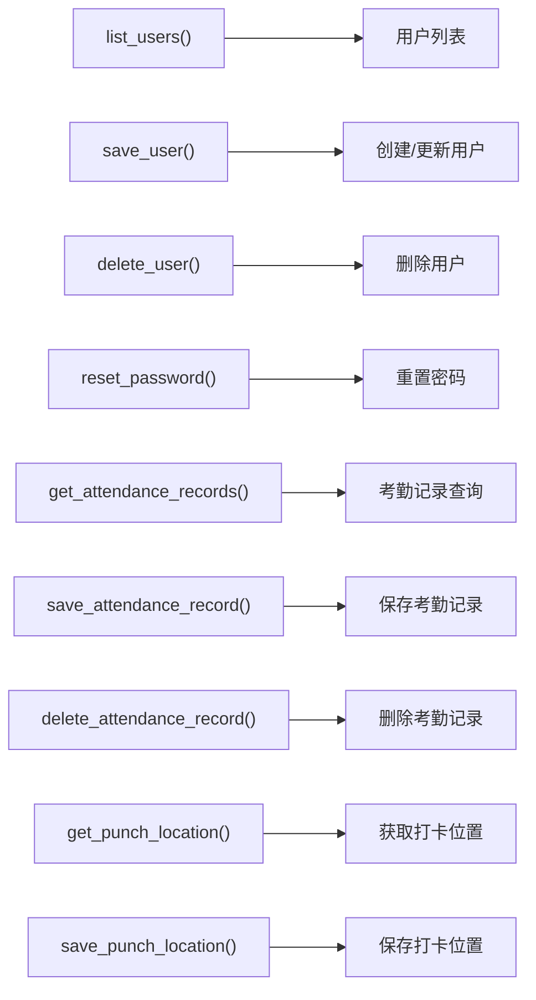
```mermaid
graph LR
    A["list_users()"] --> B["用户列表"]
    C["save_user()"] --> D["创建/更新用户"]
    E["delete_user()"] --> F["删除用户"]
    G["reset_password()"] --> H["重置密码"]
    I["get_attendance_records()"] --> J["考勤记录查询"]
    K["save_attendance_record()"] --> L["保存考勤记录"]
    M["delete_attendance_record()"] --> N["删除考勤记录"]
    O["get_punch_location()"] --> P["获取打卡位置"]
    Q["save_punch_location()"] --> R["保存打卡位置"]
```

#### TeacherService

**文件**: `services/teacher_service.py`

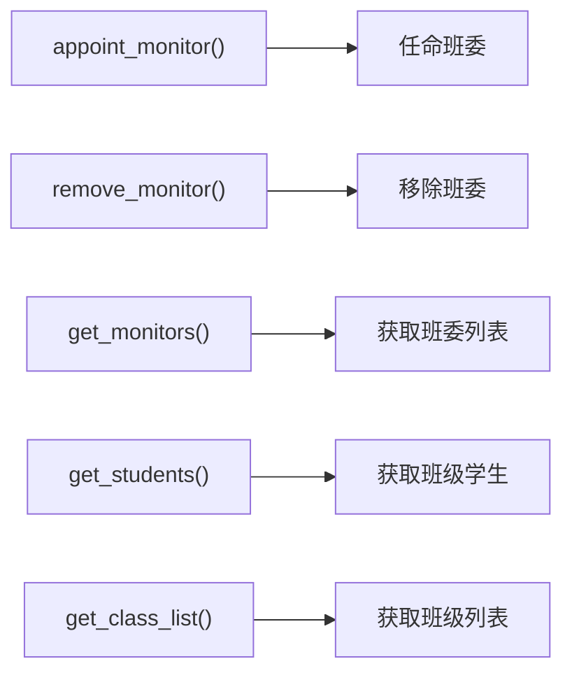
```mermaid
graph LR
    A["appoint_monitor()"] --> B["任命班委"]
    C["remove_monitor()"] --> D["移除班委"]
    E["get_monitors()"] --> F["获取班委列表"]
    G["get_students()"] --> H["获取班级学生"]
    I["get_class_list()"] --> J["获取班级列表"]
```

#### MonitorService

**文件**: `services/monitor_service.py`

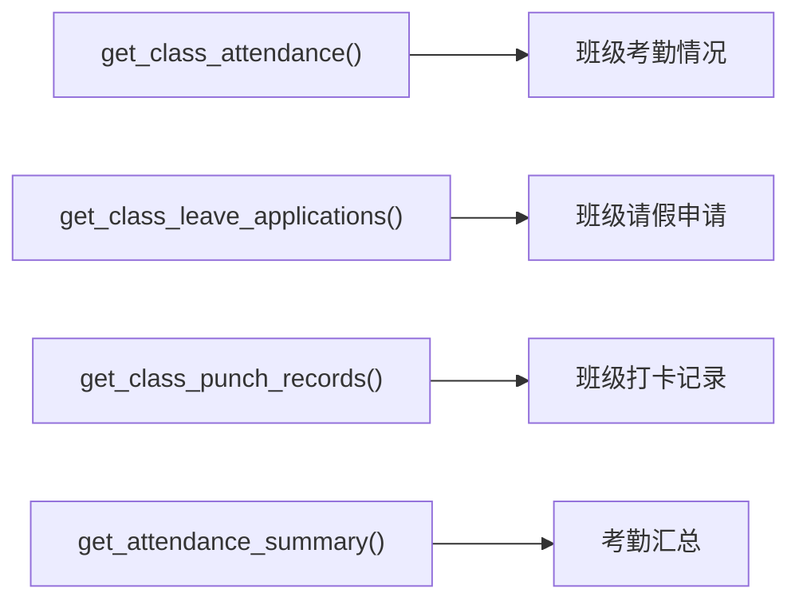
```mermaid
graph LR
    A["get_class_attendance()"] --> B["班级考勤情况"]
    C["get_class_leave_applications()"] --> D["班级请假申请"]
    E["get_class_punch_records()"] --> F["班级打卡记录"]
    G["get_attendance_summary()"] --> H["考勤汇总"]
```

#### StatisticsService

**文件**: `services/statistics_service.py`

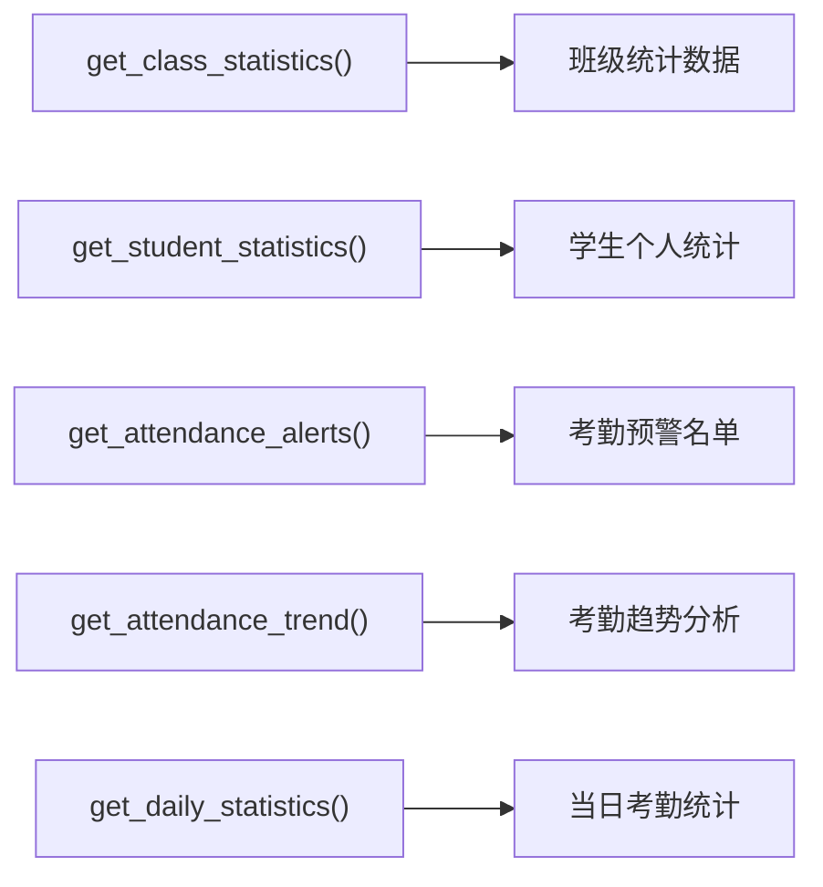
```mermaid
graph LR
    A["get_class_statistics()"] --> B["班级统计数据"]
    C["get_student_statistics()"] --> D["学生个人统计"]
    E["get_attendance_alerts()"] --> F["考勤预警名单"]
    G["get_attendance_trend()"] --> H["考勤趋势分析"]
    I["get_daily_statistics()"] --> J["当日考勤统计"]
```

---

## 功能列表

### 1. 登录认证
- 支持学生、教师、班委、管理员四种角色
- 学号/工号 + 密码登录
- 登录成功后自动存储用户信息和JWT令牌
- 登录输入长度验证（账户6-12位，密码6-20位）
- 错误信息模糊化处理，防止信息泄露

### 2. 学生功能
- **打卡签到**：一键打卡，自动获取当前位置
- **地图展示**：页面显示实时位置地图
- **位置验证**：必须在管理员设置的范围内才能打卡成功
- **请假申请**：提交请假开始和结束日期
- **打卡记录**：查看历史打卡记录
- **请假记录**：查看请假申请状态

### 3. 教师功能
- **班级学生列表**：查看班级学生及打卡状态
- **班委任命**：任命学生为班委
- **班委移除**：移除学生班委职务
- **请假审批**：查看并审批学生请假申请
- **班级列表**：获取所有班级信息

### 4. 管理员功能
- **用户管理**：添加、修改、删除用户
- **考勤记录管理**：查看、添加、修改、删除考勤记录
- **打卡位置配置**：设置打卡位置（名称、经纬度、半径）
- **考勤筛选**：按用户名、用户ID、日期范围、请假状态筛选

### 5. 主题切换
- 支持多主题颜色切换
- 主题状态全局保存

---

## 快速开始

### 1. 环境要求

- Python 3.7+
- 微信开发者工具
- Node.js（可选，用于代码检查）

### 2. 后端部署

```bash
# 进入后端目录
cd backend

# 安装依赖
pip install -r requirements.txt

# 配置环境变量（可选，使用默认值可跳过）
cp .env.example .env
# 编辑 .env 文件修改配置

# 启动服务
python app.py
```

后端服务启动后：
- API服务：http://localhost:5000/api
- 管理后台：http://localhost:5000/admin

### 3. 测试账户

| 角色 | 用户ID | 用户名 | 密码 |
|------|--------|--------|------|
| 管理员 | admin001 | 管理员 | admin123 |
| 学生 | 2024001 | 张三 | 123456 |
| 学生 | 2024002 | 李四 | 123456 |
| 班委 | 2024003 | 王五 | 123456 |
| 教师 | t001 | 张老师 | 123456 |

---

## 安全特性

1. **JWT认证**：所有敏感API都需要携带有效的JWT Token
2. **角色权限控制**：使用 `@token_required` 和 `@role_required` 装饰器进行权限验证
3. **密码安全存储**：密码使用SHA-256+盐值哈希存储
4. **输入验证**：登录输入长度限制（账户6-12位，密码6-20位）
5. **错误信息模糊化**：防止通过错误信息推断用户存在性
6. **管理员保护**：防止删除最后一个管理员账户
7. **SQL注入防护**：BaseDAO层实现表名白名单和参数验证

---

## 许可证

MIT License

---

欢迎使用微信小程序班级考勤系统！🎉
