# 班级考勤微信小程序系统设计文档

## 一、系统架构设计

#### 一、 总体架构风格

本系统采用 **单体分层架构**，自上而下划分为 **前端展示层**、**后端服务层** 和 **数据层**。技术选型为微信小程序 + Flask + SQLite，前端通过微信小程序提供用户交互界面，后端提供 RESTful API 服务，数据采用 SQLite 数据库进行管理。前后端通过同步 HTTP/REST 通信，后端各模块运行于同一进程中，通过方法调用协作。

##### mermaid展示:

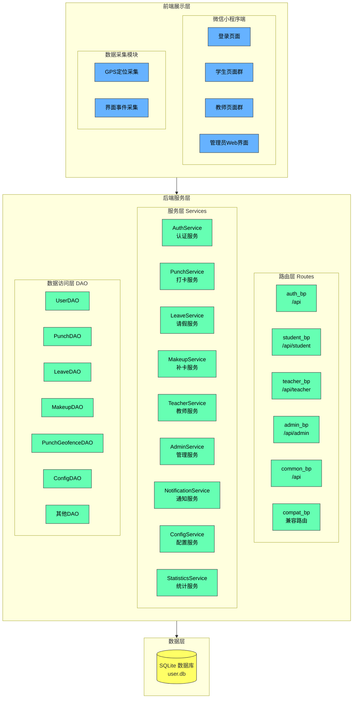

#### 二、 模块划分与职责

| 层级 | 模块 | 包含组件 | 职责描述 |
| :--- | :--- | :--- | :--- |
| 前端展示层 | 微信小程序端 | 登录页面、学生页面群、教师页面群 | 负责用户交互与界面渲染，根据不同角色呈现对应视图 |
| 前端展示层 | 管理员Web界面 | admin.html | 提供管理员用户管理、考勤管理的浏览器界面 |
| 前端展示层 | 数据采集模块 | GPS定位、界面事件 | 获取用户位置信息，采集用户行为事件 |
| 后端服务层 | 路由层 | auth_bp、student_bp、teacher_bp、admin_bp、common_bp、compat_bp | 接收 HTTP 请求；参数校验；权限验证；调用 Service 层；返回统一格式响应 |
| 后端服务层 | 服务层 | AuthService、PunchService、LeaveService、MakeupService、TeacherService、AdminService、NotificationService、ConfigService、StatisticsService、LogService、MakeupService | 执行业务逻辑；状态校验；协调多个 DAO 操作；事务管理 |
| 后端服务层 | 数据访问层 | UserDAO、PunchDAO、LeaveDAO、MakeupDAO、PunchGeofenceDAO、ConfigDAO 及各 Organization DAO | 读写 SQLite 数据库；参数化查询；返回模型对象 |
| 数据层 | 数据存储 | SQLite 数据库 (user.db) | 持久化存储所有业务数据 |

***

#### 三、 子系统/服务边界与通信方式

1. **前端展示层 ↔ 后端服务层**

   - **通信协议**: HTTP / REST
   - **通信方式**: 同步请求-响应
   - **认证方式**: JWT Bearer Token
   - **数据流向**:
     - 微信小程序调用 REST API 执行操作
     - 位置打卡时传递 GPS 经纬度坐标
     - 管理员 Web 界面通过 Cookie 或 Token 进行认证

2. **后端服务层内部模块间通信**

   各模块部署于同一 Flask 应用内，通过本地方法调用完成协作:

   - 路由层 → 服务层: 接收请求后调用对应 Service 方法
   - 服务层 → DAO 层: 服务编排时调用多个 DAO 完成数据操作
   - 服务层之间: 某些服务可能调用其他服务（如 StatisticsService 被 teacher/student 路由调用）

3. **数据层与业务层的交互**

   - 业务层通过 DAO 层访问数据库
   - DAO 层使用参数化查询防止 SQL 注入
   - 使用事务确保数据一致性

# 二、技术选型

## 2.1 前端技术栈

| 技术 | 版本 | 用途 |
| :--- | :--- | :--- |
| 微信小程序 | - | 用户界面，iOS/Android/H5 多端支持 |
| JavaScript (ES6+) | - | 小程序逻辑开发 |
| WXML/WXSS | - | 模板和样式 |
| 微信地图 API | - | GPS 定位和地图展示 |

## 2.2 后端技术栈

| 技术 | 版本 | 用途 |
| :--- | :--- | :--- |
| Flask | 3.x | Web 框架，提供 RESTful API |
| JWT (PyJWT) | - | Token 认证机制 |
| bcrypt | - | 密码哈希存储 |
| SQLite | - | 轻量级关系型数据库 |
| Python | 3.7+ | 编程语言 |

## 2.3 数据存储

| 技术 | 用途 |
| :--- | :--- |
| SQLite | 主数据库，存储用户、打卡、请假、配置等所有业务数据 |
| JSON | 部分配置数据存储（如假期范围） |
| Cookie | 管理员 Web 端会话管理 |

## 2.4 其他技术

| 技术 | 用途 |
| :--- | :--- |
| Blueprint | Flask 路由模块化 |
| 装饰器 | 认证 @token_required、权限 @role_required |
| 链路追踪 | trace_id 透传 |
| CORS | 跨域资源共享 |

# 三、数据设计

## 用例图

```mermaid
graph TD
    %% 参与者
    User["用户"]
    Admin["管理员"]
    Teacher["教师"]
    Student["学生"]
    Monitor["班委"]

    %% 系统边界
    subgraph SystemBoundary["班级考勤系统"]
        %% 学生用例
        UC1["(登录)"]
        UC2["(打卡签到)"]
        UC3["(查看打卡记录)"]
        UC4["(请假申请)"]
        UC5["(查看请假记录)"]
        UC6["(补卡申请)"]
        UC7["(查看补卡记录)"]
        UC8["(查看通知)"]

        %% 班委用例
        UC9["(查看班级打卡状态)"]
        UC10["(查看班级请假)"]
        UC11["(查看班级补卡)"]

        %% 教师用例
        UC12["(查看班级列表)"]
        UC13["(查看班级学生)"]
        UC14["(查看打卡汇总)"]
        UC15["(审批请假)"]
        UC16["(审批补卡)"]
        UC17["(任命班委)"]
        UC18["(撤销班委)"]

        %% 管理员用例
        UC19["(用户管理)"]
        UC20["(考勤记录管理)"]
        UC21["(打卡位置配置)"]
        UC22["(打卡规则配置)"]
        UC23["(全局配置)"]
        UC24["(组织架构管理)"]
        UC25["(导出考勤数据)"]
    end

    %% 关联关系 - 学生
    Student --> UC1
    Student --> UC2
    Student --> UC3
    Student --> UC4
    Student --> UC5
    Student --> UC6
    Student --> UC7
    Student --> UC8

    %% 关联关系 - 班委
    Monitor --> UC1
    Monitor --> UC2
    Monitor --> UC3
    Monitor --> UC4
    Monitor --> UC5
    Monitor --> UC6
    Monitor --> UC7
    Monitor --> UC8
    Monitor --> UC9
    Monitor --> UC10
    Monitor --> UC11

    %% 关联关系 - 教师
    Teacher --> UC1
    Teacher --> UC12
    Teacher --> UC13
    Teacher --> UC14
    Teacher --> UC15
    Teacher --> UC16
    Teacher --> UC17
    Teacher --> UC18

    %% 关联关系 - 管理员
    Admin --> UC19
    Admin --> UC20
    Admin --> UC21
    Admin --> UC22
    Admin --> UC23
    Admin --> UC24
    Admin --> UC25
```

## ER图

#### 总体ER图

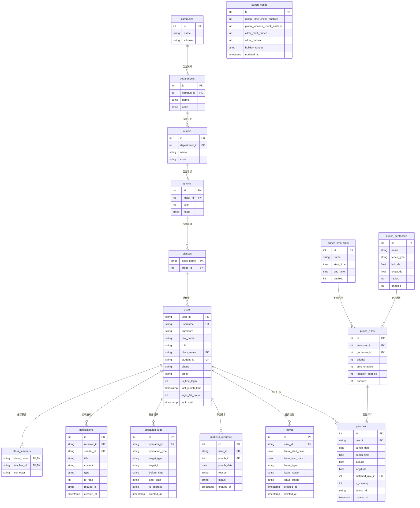

#### user的ER图

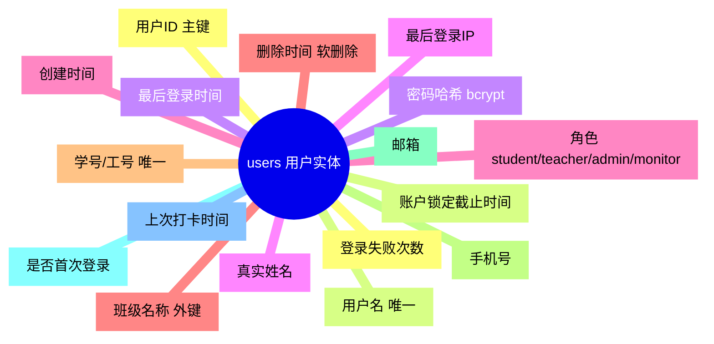

#### punch的ER图

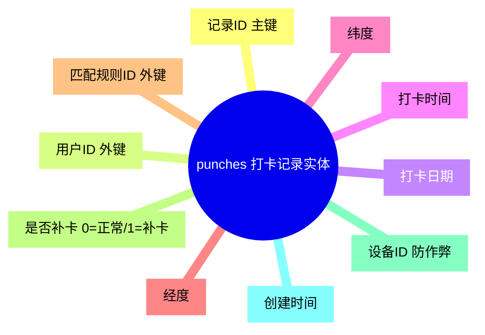

#### leave的ER图

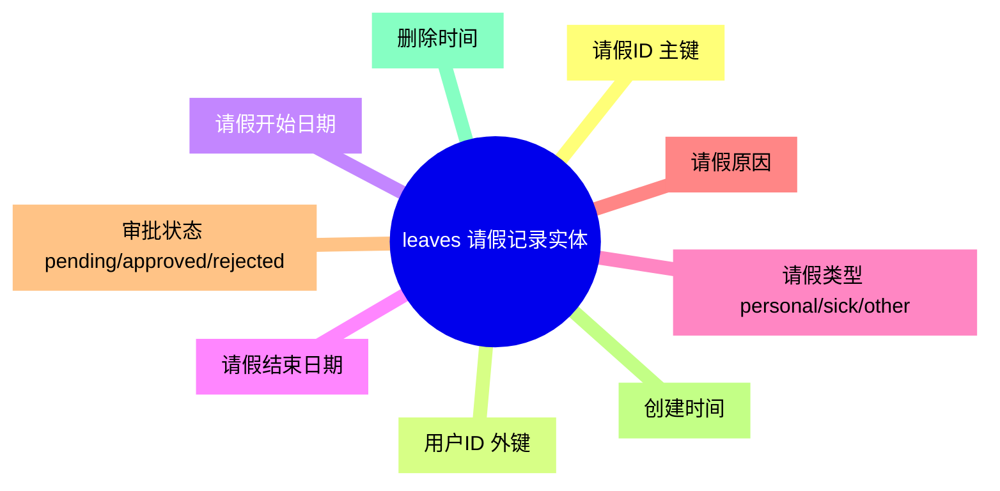

#### makeup_request的ER图

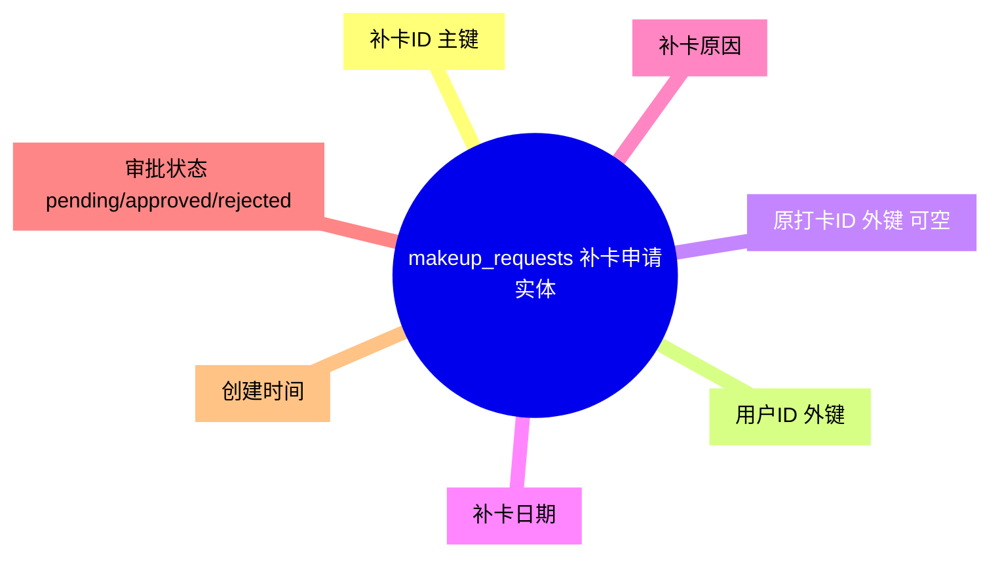

#### punch_geofence的ER图

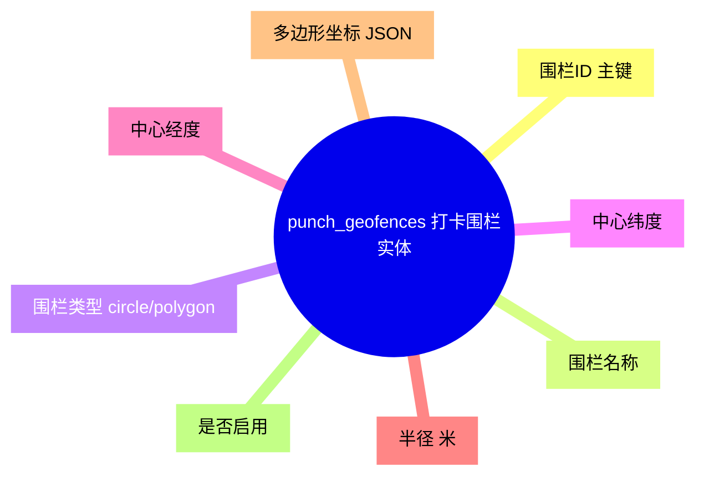

#### punch_rule的ER图

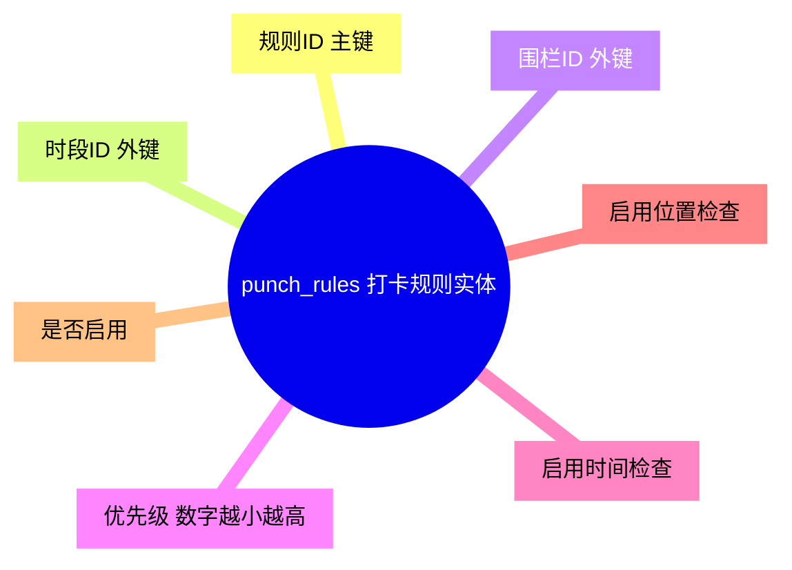

## 核心数据表与规范

### 1. users.json(用户表结构)

```sql
CREATE TABLE users (
    user_id TEXT PRIMARY KEY,
    username TEXT UNIQUE NOT NULL,
    password TEXT NOT NULL,
    real_name TEXT NOT NULL,
    role TEXT NOT NULL CHECK(role IN ('student', 'teacher', 'admin', 'monitor')),
    class_name TEXT,
    student_id TEXT UNIQUE,
    phone TEXT,
    email TEXT,
    is_first_login INTEGER DEFAULT 1,
    last_punch_time TIMESTAMP,
    login_fail_count INTEGER DEFAULT 0,
    lock_until TIMESTAMP,
    last_login_time TIMESTAMP,
    last_login_ip TEXT,
    created_at TIMESTAMP DEFAULT CURRENT_TIMESTAMP,
    deleted_at TIMESTAMP
);
```

**字段说明**:

| 字段 | 类型 | 必填 | 说明 |
| :--- | :--- | :--- | :--- |
| `user_id` | TEXT | 是 | 用户唯一标识，主键。建议格式 `"S2024001"`、`"T2024001"`、`"admin001"` |
| `username` | TEXT | 是 | 用户名，唯一约束，用于登录 |
| `password` | TEXT | 是 | bcrypt 哈希存储的密码 |
| `real_name` | TEXT | 是 | 真实姓名 |
| `role` | TEXT | 是 | 角色枚举：`student`（学生）、`teacher`（教师）、`admin`（管理员）、`monitor`（班委） |
| `class_name` | TEXT | 否 | 所属班级，外键引用 classes 表 |
| `student_id` | TEXT | 否 | 学号/工号，唯一约束 |
| `phone` | TEXT | 否 | 手机号 |
| `email` | TEXT | 否 | 邮箱 |
| `is_first_login` | INTEGER | 否 | 是否首次登录，首次登录可能需要修改密码 |
| `login_fail_count` | INTEGER | 否 | 连续登录失败次数，达到 5 次后锁定 1 小时 |
| `lock_until` | TIMESTAMP | 否 | 账户锁定截止时间 |

***

### 2. punches(打卡记录表)

```sql
CREATE TABLE punches (
    id INTEGER PRIMARY KEY AUTOINCREMENT,
    user_id TEXT NOT NULL,
    punch_date DATE NOT NULL,
    punch_time TIME NOT NULL,
    latitude REAL NOT NULL,
    longitude REAL NOT NULL,
    matched_rule_id INTEGER,
    is_makeup INTEGER NOT NULL DEFAULT 0,
    device_id TEXT,
    created_at TIMESTAMP NOT NULL DEFAULT CURRENT_TIMESTAMP,
    FOREIGN KEY (user_id) REFERENCES users(user_id) ON DELETE CASCADE,
    FOREIGN KEY (matched_rule_id) REFERENCES punch_rules(id) ON DELETE SET NULL
);

CREATE INDEX idx_punches_user_date ON punches(user_id, punch_date);
CREATE INDEX idx_punches_device_date ON punches(device_id, punch_date);
```

**字段说明**:

| 字段 | 类型 | 必填 | 说明 |
| :--- | :--- | :--- | :--- |
| `id` | INTEGER | 是 | 自增主键 |
| `user_id` | TEXT | 是 | 用户ID，外键引用 users 表 |
| `punch_date` | DATE | 是 | 打卡日期 |
| `punch_time` | TIME | 是 | 打卡时间 |
| `latitude` | REAL | 是 | 打卡时纬度 |
| `longitude` | REAL | 是 | 打卡时经度 |
| `matched_rule_id` | INTEGER | 否 | 匹配的打卡规则ID，用于审计 |
| `is_makeup` | INTEGER | 否 | 是否为补卡记录，0=正常，1=补卡 |
| `device_id` | TEXT | 否 | 设备唯一标识，用于防作弊检测 |

***

### 3. leaves(请假记录表)

```sql
CREATE TABLE leaves (
    id INTEGER PRIMARY KEY AUTOINCREMENT,
    user_id TEXT NOT NULL,
    leave_start_date DATE NOT NULL,
    leave_end_date DATE NOT NULL,
    leave_type TEXT NOT NULL,
    leave_reason TEXT,
    leave_status TEXT NOT NULL DEFAULT 'pending',
    created_at TIMESTAMP NOT NULL DEFAULT CURRENT_TIMESTAMP,
    deleted_at TIMESTAMP,
    FOREIGN KEY (user_id) REFERENCES users(user_id) ON DELETE CASCADE
);
```

**字段说明**:

| 字段 | 类型 | 必填 | 说明 |
| :--- | :--- | :--- | :--- |
| `id` | INTEGER | 是 | 自增主键 |
| `user_id` | TEXT | 是 | 用户ID，外键引用 users 表 |
| `leave_start_date` | DATE | 是 | 请假开始日期 |
| `leave_end_date` | DATE | 是 | 请假结束日期 |
| `leave_type` | TEXT | 是 | 请假类型：`personal`（事假）、`sick`（病假）、`other`（其他） |
| `leave_reason` | TEXT | 否 | 请假原因 |
| `leave_status` | TEXT | 否 | 审批状态：`pending`（待审批）、`approved`（已批准）、`rejected`（已拒绝） |

***

### 4. makeup_requests(补卡申请表)

```sql
CREATE TABLE makeup_requests (
    id INTEGER PRIMARY KEY AUTOINCREMENT,
    user_id TEXT NOT NULL,
    punch_id INTEGER,
    punch_date DATE NOT NULL,
    reason TEXT NOT NULL,
    status TEXT NOT NULL DEFAULT 'pending',
    created_at TIMESTAMP NOT NULL DEFAULT CURRENT_TIMESTAMP,
    FOREIGN KEY (user_id) REFERENCES users(user_id) ON DELETE CASCADE,
    FOREIGN KEY (punch_id) REFERENCES punches(id) ON DELETE SET NULL
);
```

**字段说明**:

| 字段 | 类型 | 必填 | 说明 |
| :--- | :--- | :--- | :--- |
| `id` | INTEGER | 是 | 自增主键 |
| `user_id` | TEXT | 是 | 用户ID，外键引用 users 表 |
| `punch_id` | INTEGER | 否 | 原打卡记录ID（如果已补卡） |
| `punch_date` | DATE | 是 | 申请补卡的日期 |
| `reason` | TEXT | 是 | 补卡原因 |
| `status` | TEXT | 否 | 审批状态：`pending`、`approved`、`rejected` |

***

### 5. punch_geofences(打卡围栏表)

```sql
CREATE TABLE punch_geofences (
    id INTEGER PRIMARY KEY AUTOINCREMENT,
    name TEXT NOT NULL,
    fence_type TEXT NOT NULL DEFAULT 'circle',
    latitude REAL NOT NULL,
    longitude REAL NOT NULL,
    radius INTEGER NOT NULL DEFAULT 100,
    polygon_coords TEXT,
    enabled INTEGER NOT NULL DEFAULT 1
);
```

**字段说明**:

| 字段 | 类型 | 必填 | 说明 |
| :--- | :--- | :--- | :--- |
| `id` | INTEGER | 是 | 自增主键 |
| `name` | TEXT | 是 | 围栏名称，如"教学楼A" |
| `fence_type` | TEXT | 否 | 围栏类型：`circle`（圆形）、`polygon`（多边形） |
| `latitude` | REAL | 是 | 围栏中心纬度 |
| `longitude` | REAL | 是 | 围栏中心经度 |
| `radius` | INTEGER | 否 | 围栏半径（米），圆形围栏使用 |
| `polygon_coords` | TEXT | 否 | 多边形坐标点，JSON 格式 |
| `enabled` | INTEGER | 否 | 是否启用，1=启用，0=禁用 |

***

### 6. punch_rules(打卡规则表)

```sql
CREATE TABLE punch_rules (
    id INTEGER PRIMARY KEY AUTOINCREMENT,
    time_slot_id INTEGER,
    geofence_id INTEGER,
    priority INTEGER NOT NULL DEFAULT 100,
    time_enabled INTEGER NOT NULL DEFAULT 1,
    location_enabled INTEGER NOT NULL DEFAULT 1,
    enabled INTEGER NOT NULL DEFAULT 1,
    FOREIGN KEY (time_slot_id) REFERENCES punch_time_slots(id) ON DELETE SET NULL,
    FOREIGN KEY (geofence_id) REFERENCES punch_geofences(id) ON DELETE SET NULL
);
```

**字段说明**:

| 字段 | 类型 | 必填 | 说明 |
| :--- | :--- | :--- | :--- |
| `id` | INTEGER | 是 | 自增主键 |
| `time_slot_id` | INTEGER | 否 | 关联的时段ID |
| `geofence_id` | INTEGER | 否 | 关联的围栏ID |
| `priority` | INTEGER | 否 | 优先级，数字越小优先级越高 |
| `time_enabled` | INTEGER | 否 | 是否启用时间检查 |
| `location_enabled` | INTEGER | 否 | 是否启用位置检查 |
| `enabled` | INTEGER | 否 | 规则是否启用 |

***

### 7. punch_config(打卡配置表)

```sql
CREATE TABLE punch_config (
    id INTEGER PRIMARY KEY,
    global_time_check_enabled INTEGER NOT NULL DEFAULT 1,
    global_location_check_enabled INTEGER NOT NULL DEFAULT 1,
    allow_multi_punch INTEGER NOT NULL DEFAULT 0,
    allow_makeup INTEGER NOT NULL DEFAULT 1,
    holiday_ranges TEXT,
    updated_at TIMESTAMP NOT NULL DEFAULT CURRENT_TIMESTAMP
);
```

**字段说明**:

| 字段 | 类型 | 必填 | 说明 |
| :--- | :--- | :--- | :--- |
| `global_time_check_enabled` | INTEGER | 否 | 全局时间检查是否启用 |
| `global_location_check_enabled` | INTEGER | 否 | 全局位置检查是否启用 |
| `allow_multi_punch` | INTEGER | 否 | 是否允许多人打卡（防作弊） |
| `allow_makeup` | INTEGER | 否 | 是否允许补卡 |
| `holiday_ranges` | TEXT | 否 | 假期日期范围，JSON 格式 |

### 通用规范

- **数据库**: SQLite，主数据库文件 `user.db`
- **主键类型**: 用户表使用 TEXT 主键，业务记录表使用自增 INTEGER 主键
- **外键约束**: 使用 ON DELETE CASCADE 级联删除
- **软删除**: users 表使用 `deleted_at` 字段标记删除，leaves 表使用软删除
- **时间戳**: 使用 `CURRENT_TIMESTAMP` 默认值，格式为 ISO8601
- **索引**: 常用查询字段建立复合索引，如 `idx_punches_user_date`
- **密码安全**: 所有密码使用 bcrypt 哈希存储，不存储明文
- **JWT Secret**: 生产环境必须设置强密钥，防止 Token 伪造

# 四、工程结构设计

### 4.1 后端工程结构(Flask)

#### 目录结构

```
backend/
├── app.py                              # Flask 应用入口，注册蓝图，错误处理
├── config.py                           # 配置管理，环境变量
├── db_connection.py                    # 数据库连接管理
├── query_db.py                        # 数据库查询工具
│
├── routes/                            # 路由层
│   ├── __init__.py                    # 蓝图注册
│   ├── auth.py                       # 认证相关路由 (登录)
│   ├── common.py                     # 通用路由 (通知、操作日志)
│   ├── compat.py                     # 兼容路由 (旧接口)
│   ├── student.py                    # 学生路由 (打卡、请假、补卡)
│   ├── teacher.py                    # 教师路由 (审批、班委管理)
│   ├── admin.py                      # 管理员路由 (用户、配置、组织架构)
│   ├── login.py                      # 登录页面路由
│   ├── students.py                   # 学生路由 (兼容)
│   └── teachers.py                   # 教师路由 (兼容)
│
├── services/                         # 服务层
│   ├── __init__.py                   # 服务初始化
│   ├── auth_service.py              # 认证服务：登录、密码修改、账户锁定
│   ├── punch_service.py             # 打卡服务：打卡、位置验证、记录查询
│   ├── leave_service.py             # 请假服务：请假申请、审批
│   ├── makeup_service.py             # 补卡服务：补卡申请、审批
│   ├── teacher_service.py            # 教师服务：班级管理、班委管理
│   ├── admin_service.py              # 管理服务：用户管理、考勤管理
│   ├── notification_service.py      # 通知服务：通知发送和管理
│   ├── log_service.py               # 日志服务：操作日志记录和查询
│   ├── config_service.py             # 配置服务：打卡规则配置
│   ├── statistics_service.py         # 统计服务：考勤统计和预警
│   └── monitor_service.py            # 监控服务：班委相关
│
├── dao/                              # 数据访问层
│   ├── __init__.py
│   ├── base_dao.py                  # 基础 DAO，SQL 拼接和执行
│   ├── user_dao.py                  # 用户数据访问
│   ├── punch_dao.py                 # 打卡数据访问
│   ├── leave_dao.py                 # 请假数据访问
│   ├── makeup_request_dao.py         # 补卡数据访问
│   ├── punch_geofence_dao.py         # 围栏数据访问
│   ├── punch_rule_dao.py             # 规则数据访问
│   ├── punch_time_slot_dao.py        # 时段数据访问
│   ├── punch_config_dao.py           # 配置数据访问
│   ├── notification_dao.py          # 通知数据访问
│   ├── operation_log_dao.py          # 日志数据访问
│   ├── campus_dao.py                 # 校区数据访问
│   ├── department_dao.py            # 院系数据访问
│   ├── major_dao.py                  # 专业数据访问
│   ├── grade_dao.py                  # 年级数据访问
│   ├── class_dao.py                  # 班级数据访问
│   └── class_teacher_dao.py         # 班级教师数据访问
│
├── models/                           # 数据模型
│   ├── __init__.py
│   ├── user.py                      # User 数据类
│   ├── punch.py                     # Punch 数据类
│   ├── leave.py                     # Leave 数据类
│   ├── makeup_request.py            # MakeupRequest 数据类
│   ├── punch_geofence.py            # PunchGeofence 数据类
│   ├── punch_rule.py                # PunchRule 数据类
│   ├── punch_time_slot.py           # PunchTimeSlot 数据类
│   ├── punch_config.py              # PunchConfig 数据类
│   ├── notification.py              # Notification 数据类
│   ├── operation_log.py              # OperationLog 数据类
│   ├── campus.py                    # Campus 数据类
│   ├── department.py                # Department 数据类
│   ├── major.py                     # Major 数据类
│   ├── grade.py                     # Grade 数据类
│   ├── class_model.py               # Class 数据类
│   └── class_teacher.py             # ClassTeacher 数据类
│
├── utils/                           # 工具模块
│   ├── __init__.py
│   ├── api_response.py             # 统一响应格式
│   ├── auth.py                     # JWT 认证：generate_token, decode_token, @token_required, @role_required
│   ├── exceptions.py               # 自定义异常：ServiceException
│   └── geo.py                      # 地理计算：calculate_distance (Haversine公式)
│
├── db/                             # 数据库初始化
│   ├── __init__.py
│   ├── init_db.py                  # 数据库初始化脚本
│   └── schema/                     # SQL 模式文件
│       ├── 01_campuses.sql
│       ├── 02_departments.sql
│       ├── 03_majors.sql
│       ├── 04_grades.sql
│       ├── 05_classes.sql
│       ├── 06_users.sql
│       ├── 07_class_teachers.sql
│       ├── 08_punch_geofences.sql
│       ├── 09_punch_time_slots.sql
│       ├── 10_punch_rules.sql
│       ├── 11_punches.sql
│       ├── 12_leaves.sql
│       ├── 13_makeup_requests.sql
│       ├── 14_punch_config.sql
│       ├── 15_operation_logs.sql
│       ├── 16_notifications.sql
│       └── 17_read_views.sql
│
├── templates/                      # HTML 模板
│   ├── login.html                # 登录页面
│   └── admin.html                # 管理后台页面
│
├── tests/                        # 测试目录
│   ├── conftest.py
│   ├── test_api/                # API 测试
│   ├── test_services/           # 服务层测试
│   ├── test_dao/                # DAO 层测试
│   ├── test_models/             # 模型测试
│   └── test_db/                 # 数据库测试
│
├── .env.example                 # 环境变量示例
└── requirements.txt              # Python 依赖
```

#### 各层职责边界

| 层 | 职责 | 不做什么 |
| :--- | :--- | :--- |
| Routes | 接收 HTTP 请求；参数校验；权限验证（@token_required、@role_required）；调用 Service；返回统一格式响应 (jsonify) | 不写业务逻辑；不直接操作数据库 |
| Service | 执行业务逻辑；状态校验；协调多个 DAO 操作；事务管理；抛出 ServiceException | 不直接操作 HTTP；不处理路由细节 |
| DAO | 读写 SQLite 数据库；参数化查询防注入；返回模型对象或字典 | 不做任何业务判断 |
| Model | 数据结构定义；类型注解；dataclass 装饰器 | 不包含业务逻辑 |

#### 统一响应体格式

成功响应：
```json
{
    "code": 200,
    "message": "success",
    "data": { ... }
}
```

错误响应：
```json
{
    "code": <错误码>,
    "message": "<错误描述>",
    "data": null
}
```

#### 关键设计说明

**JWT 认证装饰器**

```python
@token_required  # 验证 Token 是否存在且有效
@role_required(['student', 'monitor'])  # 验证用户角色
```

Token payload 结构：
```python
{
    'user_id': 'S2024001',
    'username': 'zhang_student',
    'role': 'student',
    'class': '计算机24级1班',
    'exp': ...,
    'iat': ...
}
```

**ServiceException 异常处理**

所有业务异常使用 ServiceException 抛出，由 app.py 中的全局错误处理器转换为统一格式响应：
- HTTP 400: 参数错误、业务规则违反
- HTTP 401: 未认证
- HTTP 403: 无权限

**并发保护**

SQLite 使用文件锁机制，同一时刻只允许一个写入操作。DAO 层使用参数化查询防止 SQL 注入。

**地理围栏计算**

使用 Haversine 公式计算两点间的球面距离：
```python
def calculate_distance(lat1, lon1, lat2, lon2):
    # 返回单位：米
```

***

### 4.2 前端工程结构(微信小程序)

#### 目录结构

```
miniprogram/
├── app.js                          # 应用入口
├── app.json                        # 应用配置
├── app.wxss                        # 全局样式
│
├── network/                        # 网络请求层
│   ├── request.js                  # axios 风格封装：统一注入 Token、处理 401/403
│   └── api.js                      # API 接口集合
│
├── config/
│   └── api.js                      # API 地址配置
│
├── components/                     # 通用组件
│   ├── navbar/                    # 导航栏组件
│   ├── custom-tabbar/             # 自定义 tabbar
│   ├── student-tabbar/            # 学生 tabbar
│   └── teacher-tabbar/             # 教师 tabbar
│
├── pages/
│   ├── login/                     # 登录页面
│   │   ├── login.js
│   │   ├── login.wxml
│   │   ├── login.wxss
│   │   └── login.json
│   │
│   ├── student/                   # 学生页面群
│   │   ├── index/                 # 学生首页
│   │   ├── punch/                 # 打卡页面
│   │   ├── records/               # 打卡记录
│   │   ├── leave/                 # 请假申请
│   │   ├── leave-records/          # 请假记录
│   │   ├── makeup/                # 补卡申请
│   │   ├── notifications/          # 通知列表
│   │   ├── profile/                # 个人中心
│   │   ├── class-records/          # 班级打卡记录 (班委)
│   │   └── ...
│   │
│   └── teacher/                   # 教师页面群
│       ├── index/                  # 教师首页
│       ├── classes/                # 班级列表
│       ├── class-detail/           # 班级详情
│       ├── approvals/              # 审批列表
│       ├── monitor/                # 班委管理
│       ├── profile/                # 个人中心
│       └── ...
│
├── styles/                        # 样式文件
│   ├── base.wxss                  # 基础样式
│   └── theme.wxss                 # 主题样式
│
├── utils/                         # 工具函数
│   ├── auth.js                    # 认证相关：获取/存储 Token
│   ├── utils.js                   # 通用工具
│   └── theme.js                   # 主题切换
│
└── project.config.json            # 项目配置
```

#### 路由设计

微信小程序使用 tabBar 页面和普通页面区分：

| 页面路径 | 类型 | 说明 |
| :--- | :--- | :--- |
| `/pages/login/login` | 普通页面 | 登录页，不在 tabBar 中 |
| `/pages/student/index/index` | tabBar 页面 | 学生端首页 |
| `/pages/student/punch/punch` | 普通页面 | 打卡页面 |
| `/pages/student/records/records` | 普通页面 | 打卡记录 |
| `/pages/student/leave/apply` | 普通页面 | 请假申请 |
| `/pages/student/leave/records` | 普通页面 | 请假记录 |
| `/pages/student/makeup/apply` | 普通页面 | 补卡申请 |
| `/pages/student/notifications/notifications` | 普通页面 | 通知列表 |
| `/pages/teacher/index/index` | tabBar 页面 | 教师端首页 |
| `/pages/teacher/classes/classes` | 普通页面 | 班级列表 |
| `/pages/teacher/class-detail/detail` | 普通页面 | 班级详情 |
| `/pages/teacher/approvals/approvals` | 普通页面 | 审批列表 |

#### request.js 请求封装

```javascript
const request = (options) => {
  return new Promise((resolve, reject) => {
    const token = wx.getStorageSync('token')
    wx.request({
      url: API_BASE_URL + options.url,
      method: options.method || 'GET',
      data: options.data,
      header: {
        'Authorization': token ? `Bearer ${token}` : '',
        'Content-Type': 'application/json'
      },
      success: (res) => {
        if (res.statusCode === 401) {
          // Token 过期，跳转登录
          wx.removeStorageSync('token')
          wx.redirectTo({ url: '/pages/login/login' })
          return reject(res.data)
        }
        if (res.statusCode === 403) {
          wx.showToast({ title: '权限不足', icon: 'none' })
          return reject(res.data)
        }
        resolve(res.data)
      },
      fail: reject
    })
  })
}
```

#### 打卡流程说明

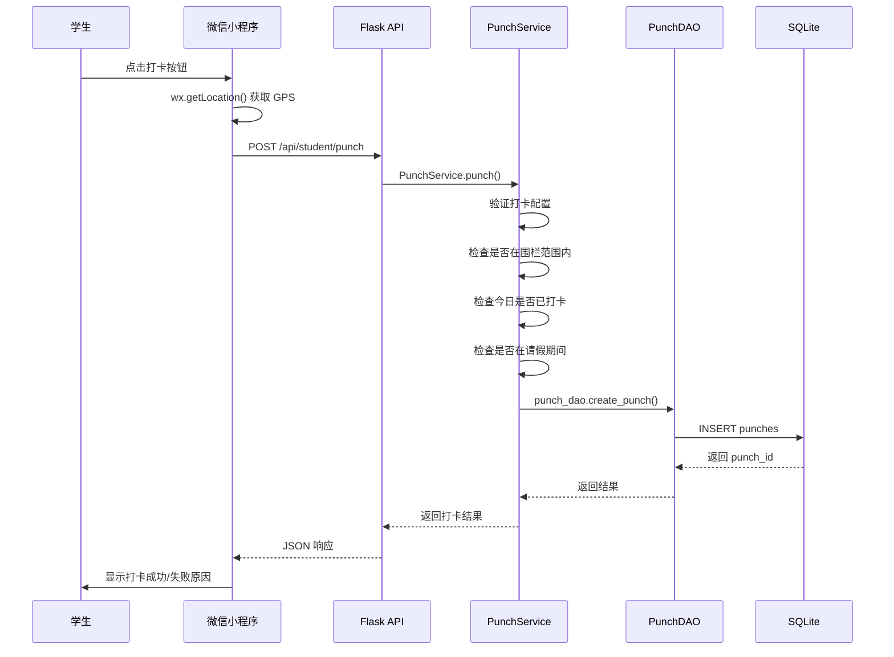

***

### 4.3 前后端联调约定

| 项目 | 约定 |
| :--- | :--- |
| 后端端口 | `5000` (Flask 默认) |
| 前端开发 | 微信开发者工具 |
| 认证方式 | JWT Bearer Token，通过 Authorization Header 传递 |
| 管理员 Web | 通过 Cookie (adminToken) 或 URL Token 参数传递 |
| 跨域处理 | Flask 配置 `Access-Control-Allow-Origin: *` |
| 接口文档 | 以本文档"接口设计"章节为唯一真相来源 |
| 时间格式 | 日期使用 `YYYY-MM-DD`，时间使用 `HH:MM:SS`，时间戳使用 ISO8601 |
| 分页参数 | `page`: 从 1 开始；`size`: 每页条数，默认 50 |

# 五、接口设计

## 一、基础约定

| 项目 | 约定 |
| :--- | :--- |
| Base URL | `/api` |
| 数据格式 | 请求/响应均采用 `application/json` |
| 认证方式 | JWT Bearer Token，Header: `Authorization: Bearer <token>` |
| HTTP 状态码 | 200 成功，400 参数错误，401 未认证，403 无权限，404 资源不存在，500 服务器错误 |
| 分页参数 | `page`: 从 1 开始，默认 1；`size`: 每页条数，默认 50，最大 100 |
| 错误响应格式 | `{ "code": <错误码>, "message": "<错误描述>", "data": null }` |
| 成功响应格式 | `{ "code": 200, "message": "success", "data": { ... } }` |
| Token 管理 | 用户端通过 Header 传递，管理员 Web 通过 Cookie 或 URL 参数传递 |

## 二、接口清单总览

### 认证接口 (`/api`)

| 方法 | 路径 | 说明 | 认证 |
| :--- | :--- | :--- | :--- |
| POST | `/login` | 用户登录 | 否 |
| POST | `/change-password` | 修改密码 | 是 |
| GET | `/current-user` | 获取当前用户信息 | 是 |

### 学生接口 (`/api/student`)

| 方法 | 路径 | 说明 | 角色 |
| :--- | :--- | :--- | :--- |
| POST | `/punch` | 打卡签到 | student, monitor |
| GET | `/punch-records` | 打卡记录（分页） | student, monitor |
| POST | `/leave/apply` | 请假申请 | student, monitor |
| GET | `/leave/records` | 请假记录（分页） | student, monitor |
| POST | `/makeup/apply` | 补卡申请 | student, monitor |
| GET | `/makeup/records` | 补卡记录（分页） | student, monitor |
| GET | `/notifications` | 通知列表 | student, monitor |
| GET | `/monitor/class-punch-status` | 班委：班级打卡状态 | monitor |
| GET | `/monitor/class-leaves` | 班委：班级待审批请假 | monitor |
| GET | `/monitor/class-makeups` | 班委：班级待审批补卡 | monitor |

### 教师接口 (`/api/teacher`)

| 方法 | 路径 | 说明 | 角色 |
| :--- | :--- | :--- | :--- |
| GET | `/classes` | 班级列表 | teacher |
| GET | `/class/students` | 班级学生列表 | teacher |
| GET | `/class/punch-summary` | 班级打卡汇总 | teacher |
| GET | `/leave/pending` | 待审批请假列表 | teacher |
| POST | `/leave/approve` | 审批请假 | teacher |
| GET | `/makeup/pending` | 待审批补卡列表 | teacher |
| POST | `/makeup/approve` | 审批补卡 | teacher |
| POST | `/monitor/appoint` | 任命班委 | teacher |
| DELETE | `/monitor/remove` | 撤销班委 | teacher |
| GET | `/monitors` | 班级班委列表 | teacher |

### 管理员接口 (`/api/admin`)

| 方法 | 路径 | 说明 | 角色 |
| :--- | :--- | :--- | :--- |
| POST | `/login` | 管理员登录 | 否 |
| GET | `/users` | 用户列表（分页） | admin |
| POST | `/users` | 创建用户 | admin |
| PUT | `/users/<user_id>` | 更新用户 | admin |
| DELETE | `/users/<user_id>` | 删除用户 | admin |
| POST | `/users/reset-password` | 重置用户密码 | admin |
| GET | `/attendance-records` | 考勤记录（分页） | admin |
| POST | `/attendance-records` | 创建考勤记录 | admin |
| GET | `/attendance/punch-records` | 打卡记录管理 | admin |
| POST | `/attendance/punch-records` | 创建打卡记录 | admin |
| PUT | `/attendance/punch-records/<id>` | 更新打卡记录 | admin |
| DELETE | `/attendance/punch-records/<id>` | 删除打卡记录 | admin |
| GET | `/attendance/leave-records` | 请假记录管理 | admin |
| POST | `/punch-location` | 获取/设置打卡位置 | admin |
| GET | `/config` | 全局配置 | admin |
| PUT | `/config` | 更新全局配置 | admin |
| GET | `/org/campuses` | 校区管理 | admin |
| POST | `/org/departments` | 院系管理 | admin |
| GET | `/org/majors` | 专业管理 | admin |
| GET | `/org/grades` | 年级管理 | admin |
| GET | `/org/classes` | 班级管理 | admin |
| GET | `/rules/time-slots` | 时段规则管理 | admin |
| GET | `/rules/punch-geofences` | 围栏管理 | admin |
| GET | `/rules/punch-rules` | 打卡规则管理 | admin |
| GET | `/dashboard/stats` | 仪表盘统计 | admin |
| GET | `/dashboard/trend` | 考勤趋势 | admin |
| GET | `/attendance/export` | 导出考勤 CSV | admin |

### 通用接口 (`/api`)

| 方法 | 路径 | 说明 | 认证 |
| :--- | :--- | :--- | :--- |
| GET | `/notifications` | 通知列表 | 是 |
| POST | `/notifications/mark-read` | 标记通知已读 | 是 |
| GET | `/notifications/unread-count` | 未读通知数量 | 是 |
| GET | `/operation-logs` | 操作日志 | admin, teacher |

## 三、接口详细定义

### 3.1 用户登录

**端点**: `POST /api/login`
**认证**: 否
**请求体**:
```json
{
  "username": "zhang_student",
  "password": "123456"
}
```

**成功响应示例**:
```json
{
  "code": 200,
  "message": "success",
  "data": {
    "token": "eyJhbGciOiJIUzI1NiIsInR5cCI6IkpXVCJ9...",
    "user": {
      "user_id": "S2024001",
      "username": "zhang_student",
      "real_name": "张三",
      "role": "student",
      "class_name": "计算机24级1班"
    }
  }
}
```

**失败响应示例**（用户名或密码错误）:
```json
{
  "code": 401,
  "message": "用户名或密码错误",
  "data": null
}
```

**失败响应示例**（账户已锁定）:
```json
{
  "code": 401,
  "message": "账户已锁定，请于 XXXX-XX-XX XX:XX:XX 后重试",
  "data": null
}
```

> 前端收到 `token` 后存入本地（wx.setStorageSync），后续请求通过 `Authorization: Bearer <token>` Header 传递。

***

### 3.2 学生打卡

**端点**: `POST /api/student/punch`
**认证**: 是 (student, monitor)
**请求体**:
```json
{
  "latitude": 39.908823,
  "longitude": 116.397470,
  "device_id": "wx_device_xxxxx"
}
```

**成功响应示例**:
```json
{
  "code": 200,
  "message": "success",
  "data": {
    "success": true,
    "message": "打卡成功",
    "data": {
      "punch_date": "2026-04-22",
      "punch_time": "08:30:15",
      "punch_id": 1
    }
  }
}
```

**失败响应示例**（不在打卡范围内）:
```json
{
  "code": 2001,
  "message": "不在打卡范围内",
  "data": null
}
```

**失败响应示例**（今日已打卡）:
```json
{
  "code": 2003,
  "message": "今日已打卡",
  "data": null
}
```

**失败响应示例**（请假期间不允许打卡）:
```json
{
  "code": 2004,
  "message": "请假期间不允许打卡",
  "data": null
}
```

***

### 3.3 获取打卡记录

**端点**: `GET /api/student/punch-records`
**认证**: 是 (student, monitor)
**查询参数**:
| 参数 | 类型 | 必填 | 说明 |
| :--- | :--- | :--- | :--- |
| start_date | string | 否 | 开始日期，格式 YYYY-MM-DD |
| end_date | string | 否 | 结束日期，格式 YYYY-MM-DD |
| page | int | 否 | 页码，默认 1 |
| size | int | 否 | 每页条数，默认 50 |

**成功响应示例**:
```json
{
  "code": 200,
  "message": "success",
  "data": {
    "items": [
      {
        "id": 1,
        "user_id": "S2024001",
        "punch_date": "2026-04-22",
        "punch_time": "08:30:15"
      }
    ],
    "total": 30,
    "page": 1,
    "size": 50,
    "total_pages": 1,
    "has_next": false
  }
}
```

***

### 3.4 请假申请

**端点**: `POST /api/student/leave/apply`
**认证**: 是 (student, monitor)
**请求体**:
```json
{
  "start_date": "2026-04-25",
  "end_date": "2026-04-27",
  "leave_type": "personal",
  "reason": "家中有事"
}
```

| 参数 | 类型 | 必填 | 说明 |
| :--- | :--- | :--- | :--- |
| start_date | string | 是 | 请假开始日期，格式 YYYY-MM-DD |
| end_date | string | 是 | 请假结束日期，格式 YYYY-MM-DD |
| leave_type | string | 否 | 请假类型，默认 personal（事假），可选 sick（病假） |
| reason | string | 否 | 请假原因 |

**成功响应示例**:
```json
{
  "code": 200,
  "message": "success",
  "data": {
    "id": 1,
    "message": "请假申请已提交"
  }
}
```

***

### 3.5 审批请假

**端点**: `POST /api/teacher/leave/approve`
**认证**: 是 (teacher)
**请求体**:
```json
{
  "leave_id": 1,
  "status": "approved"
}
```

| 参数 | 类型 | 必填 | 说明 |
| :--- | :--- | :--- | :--- |
| leave_id | int | 是 | 请假记录ID |
| status | string | 是 | 审批状态：`approved`（批准）或 `rejected`（拒绝） |

**成功响应示例**:
```json
{
  "code": 200,
  "message": "success",
  "data": {
    "leave_id": 1,
    "status": "approved",
    "message": "审批成功"
  }
}
```

***

### 3.6 补卡申请

**端点**: `POST /api/student/makeup/apply`
**认证**: 是 (student, monitor)
**请求体**:
```json
{
  "target_date": "2026-04-20",
  "reason": "因病未能及时打卡"
}
```

| 参数 | 类型 | 必填 | 说明 |
| :--- | :--- | :--- | :--- |
| target_date | string | 是 | 补卡日期，格式 YYYY-MM-DD，仅限近 3 天内 |
| reason | string | 是 | 补卡原因 |

**成功响应示例**:
```json
{
  "code": 200,
  "message": "success",
  "data": {
    "id": 1,
    "message": "补卡申请已提交"
  }
}
```

**失败响应示例**（超出补卡时限）:
```json
{
  "code": 4001,
  "message": "补卡日期和原因不能为空",
  "data": null
}
```

***

### 3.7 审批补卡

**端点**: `POST /api/teacher/makeup/approve`
**认证**: 是 (teacher)
**请求体**:
```json
{
  "makeup_id": 1,
  "status": "approved",
  "punch_time": "08:00:00"
}
```

| 参数 | 类型 | 必填 | 说明 |
| :--- | :--- | :--- | :--- |
| makeup_id | int | 是 | 补卡记录ID |
| status | string | 是 | 审批状态：`approved` 或 `rejected` |
| punch_time | string | 否 | 补卡打卡时间，审批通过时指定 |

**成功响应示例**:
```json
{
  "code": 200,
  "message": "success",
  "data": {
    "makeup_id": 1,
    "status": "approved",
    "message": "审批成功"
  }
}
```

***

### 3.8 任命班委

**端点**: `POST /api/teacher/monitor/appoint`
**认证**: 是 (teacher)
**请求体**:
```json
{
  "student_id": "S2024003"
}
```

**成功响应示例**:
```json
{
  "code": 200,
  "message": "success",
  "data": {
    "student_id": "S2024003",
    "message": "班委任命成功"
  }
}
```

***

### 3.9 获取用户列表

**端点**: `GET /api/admin/users`
**认证**: 是 (admin)
**查询参数**:
| 参数 | 类型 | 必填 | 说明 |
| :--- | :--- | :--- | :--- |
| class_name | string | 否 | 按班级筛选 |
| role | string | 否 | 按角色筛选 |
| page | int | 否 | 页码，默认 1 |
| size | int | 否 | 每页条数，默认 50 |

**成功响应示例**:
```json
{
  "code": 200,
  "message": "success",
  "data": {
    "items": [
      {
        "user_id": "S2024001",
        "username": "zhang_student",
        "real_name": "张三",
        "role": "student",
        "class_name": "计算机24级1班",
        "student_id": "2024001",
        "phone": "13800138000"
      }
    ],
    "total": 100,
    "page": 1,
    "size": 50
  }
}
```

***

### 3.10 设置打卡位置

**端点**: `POST /api/admin/punch-location`
**认证**: 是 (admin)
**请求体**:
```json
{
  "name": "教学楼A",
  "latitude": 39.908823,
  "longitude": 116.397470,
  "radius": 200,
  "enabled": 1
}
```

**成功响应示例**:
```json
{
  "code": 200,
  "message": "success",
  "data": {
    "id": 1,
    "name": "教学楼A",
    "latitude": 39.908823,
    "longitude": 116.397470,
    "radius": 200,
    "enabled": 1
  }
}
```

***

## 四、接口与数据模型对应关系

| 接口 | 读/写 | 涉及数据表 | 操作说明 |
| :--- | :--- | :--- | :--- |
| POST /login | 读写 | users | 验证密码，更新最后登录时间/失败次数 |
| POST /change-password | 写 | users | 更新密码哈希 |
| GET /current-user | 读 | users | 查询用户信息 |
| POST /student/punch | 写 | punches | 创建打卡记录 |
| GET /student/punch-records | 读 | punches | 分页查询打卡记录 |
| POST /student/leave/apply | 写 | leaves | 创建请假记录 |
| GET /student/leave/records | 读 | leaves | 分页查询请假记录 |
| POST /student/makeup/apply | 写 | makeup_requests | 创建补卡申请 |
| GET /student/makeup/records | 读 | makeup_requests | 分页查询补卡记录 |
| GET /teacher/leave/pending | 读 | leaves | 查询待审批请假 |
| POST /teacher/leave/approve | 写 | leaves | 更新请假状态 |
| GET /teacher/makeup/pending | 读 | makeup_requests | 查询待审批补卡 |
| POST /teacher/makeup/approve | 写 | makeup_requests, punches | 更新补卡状态，创建打卡记录 |
| POST /teacher/monitor/appoint | 写 | users | 更新用户角色为 monitor |
| GET /admin/users | 读 | users | 分页查询用户 |
| POST /admin/users | 写 | users | 创建用户 |
| PUT /admin/users/<id> | 写 | users | 更新用户信息 |
| DELETE /admin/users/<id> | 写 | users | 软删除用户 |
| POST /admin/punch-location | 读写 | punch_geofences | 创建/更新围栏 |
| GET /admin/config | 读 | punch_config | 查询配置 |
| PUT /admin/config | 写 | punch_config | 更新配置 |

***

## 五、补充约定

- **Token 刷新**: Token 过期后前端需引导用户重新登录
- **位置权限**: 打卡前需检查微信位置权限，未授权时提示用户开启
- **账户锁定**: 连续 5 次登录失败锁定 1 小时，使用 `lock_until` 字段控制
- **软删除**: 用户删除使用 `deleted_at` 标记，不物理删除
- **设备防作弊**: 记录 `device_id`，同一设备多人打卡时系统可检测
- **兼容路由**: `/api/students/*` 和 `/api/teachers/*` 为旧接口别名，计划于 2026-07-31 下线

# 六、关键流程设计

## 一、系统级数据流与层级调用总览

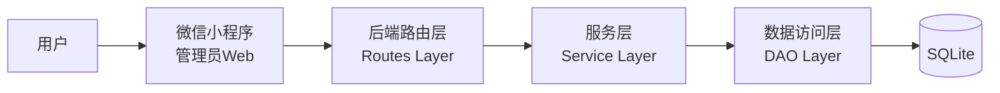

### 数据流总表（按层级）

| 来源层级 | 目标层级 | 数据载荷 | 触发时机 | 返回/结果 |
| :--- | :--- | :--- | :--- | :--- |
| 前端界面 | API 层 | username、password | 登录 | token、user_info |
| 前端界面 | API 层 | latitude、longitude | 打卡 | punch_result |
| 前端界面 | API 层 | leave/ makeup 数据 | 申请 | application_result |
| API 层 | 服务层 | 业务请求对象 | 各接口 | 业务处理结果 |
| 服务层 | DAO 层 | SQL、参数 | 数据操作 | 模型对象 |
| DAO 层 | 数据库 | SQL 语句 | CRUD | 查询结果 |

## 二、关键流程 1：登录与鉴权

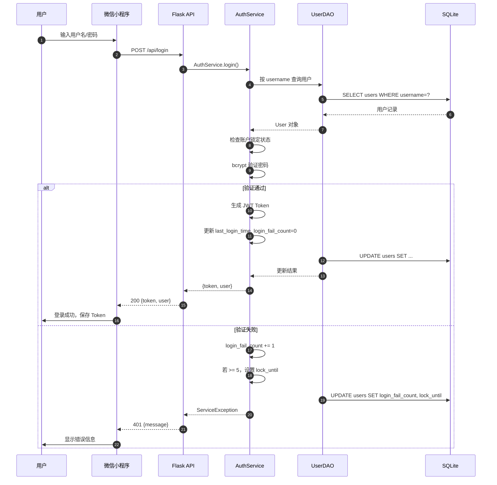

### 层级数据流与调用关系

| 步骤 | 调用关系 | 关键字段 | 成功分支 | 失败分支 |
| :--- | :--- | :--- | :--- | :--- |
| 1 | 前端 → API | username, password | 进入验证流程 | 400 参数为空 |
| 2 | API → Service | username | 查询用户 | 401 用户不存在 |
| 3 | Service → DAO | username | 返回 User 对象 | 500 数据库错误 |
| 4 | Service 内部 | 密码验证 | 生成 Token | 401 密码错误 |
| 5 | API → 前端 | token, user | 保存登录态 | 401 错误信息 |

## 三、关键流程 2：学生打卡

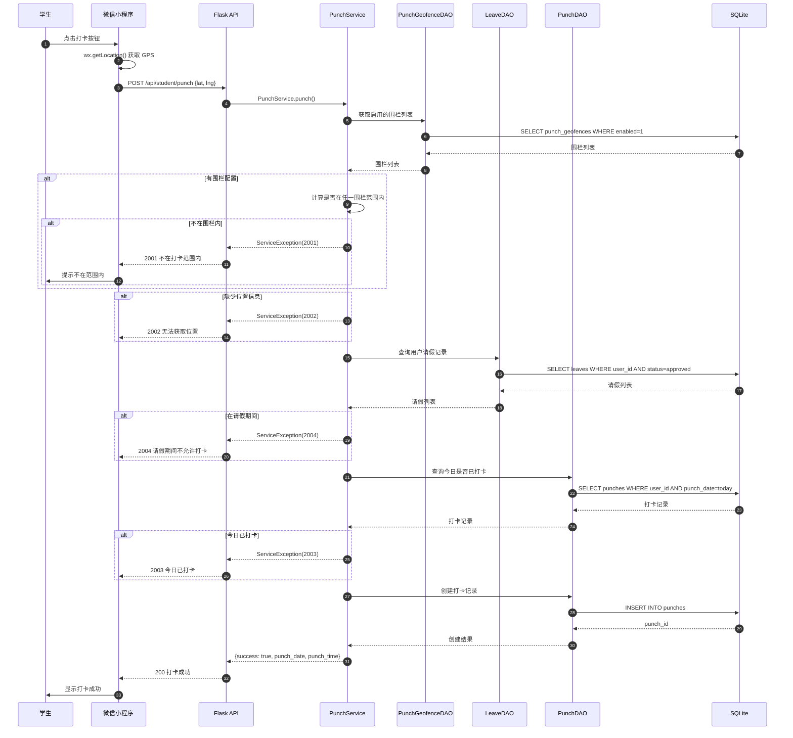

### 层级数据流与调用关系

| 步骤 | 调用关系 | 关键字段 | 结果 | 风险控制 |
| :--- | :--- | :--- | :--- | :--- |
| 获取位置 | 小程序 → 微信 | GPS 坐标 | 获取失败提示开启权限 | 权限校验 |
| 围栏校验 | Service → DAO | lat/lng, 围栏列表 | 不在范围内返回 2001 | 位置服务可用性 |
| 请假校验 | Service → DAO | user_id, today | 请假期间返回 2004 | 请假状态正确性 |
| 重复校验 | Service → DAO | user_id, today | 已打卡返回 2003 | 数据一致性 |
| 创建记录 | Service → DAO | 打卡数据 | 返回 punch_id | 事务保护 |

## 四、关键流程 3：请假审批

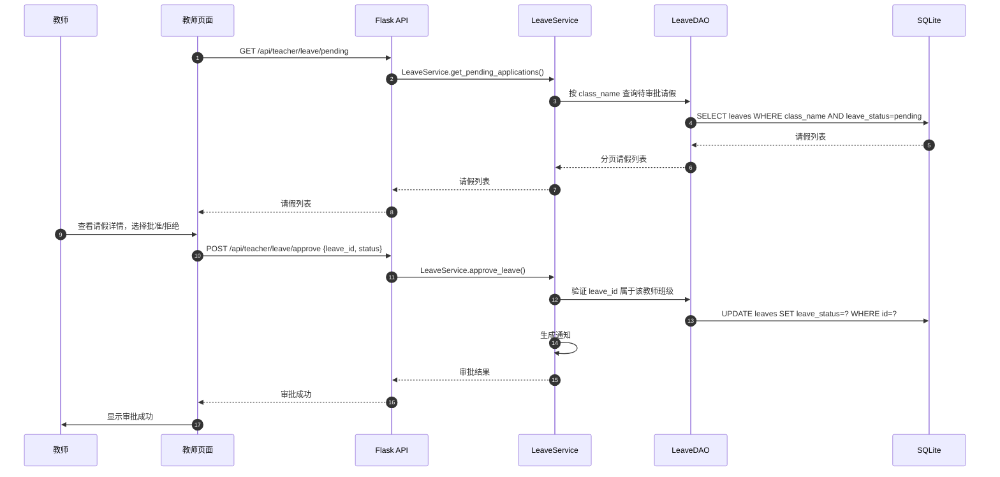

## 五、关键流程 4：补卡审批与打卡

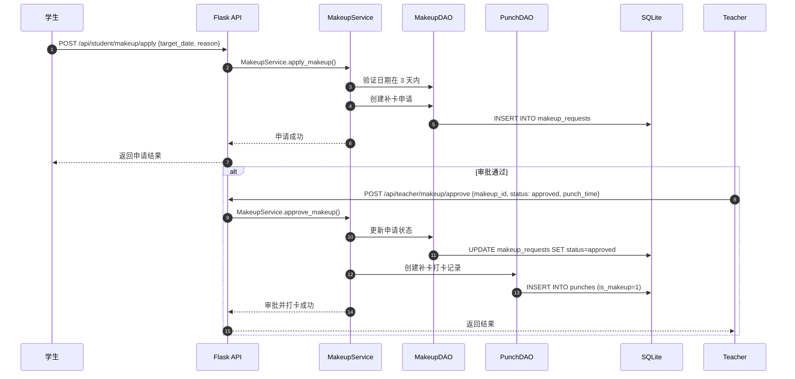

## 六、关键流程 5：班委任命

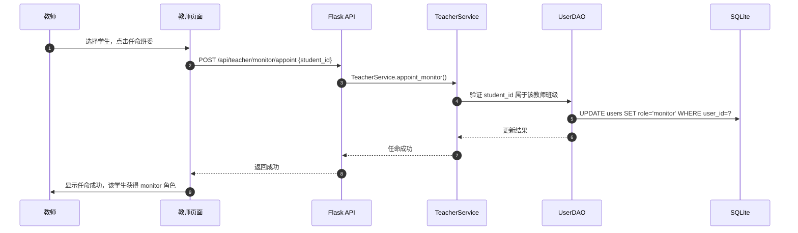

### 层级数据流与调用关系

| 分支 | 调用关系 | 关键字段 | 结果 |
| :--- | :--- | :--- | :--- |
| 任命班委 | 前端 → API → Service → DAO | student_id, class_name | 用户 role 更新为 monitor |
| 撤销班委 | 前端 → API → Service → DAO | student_id | 用户 role 恢复为 student |

## 七、关键流程 6：管理员数据导出

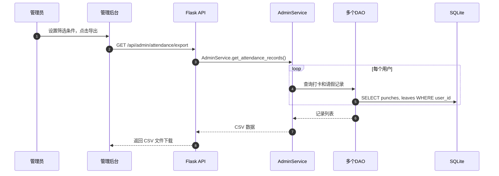

# 七、非功能性设计

## 一、性能目标（Demo）

| 指标项 | 目标值 | 说明 |
| :--- | :--- | :--- |
| 登录接口 P95 | < 500ms | 密码验证 + Token 生成 |
| 打卡接口 P95 | < 800ms | 位置校验 + 记录创建 |
| 查询接口 P95 | < 300ms | 数据库索引优化后 |
| 数据库连接 | 单文件，SQLite 原生支持 | 不需要连接池 |
| 前端首屏加载 | < 3s | 微信小程序冷启动 |

## 二、可靠性与一致性

| 项目 | 约束 |
| :--- | :--- |
| 幂等性 | 打卡接口需检查今日是否已打卡，防止重复创建 |
| 事务处理 | SQLite 单线程写入，保证ACID特性 |
| 并发控制 | SQLite 文件锁，同一时刻只允许一个写入操作 |
| 数据校验 | Service 层负责业务规则校验，DAO 层参数化查询 |
| 软删除 | 用户删除使用 deleted_at 标记，保持数据可追溯 |

## 三、安全性

| 项目 | 约束 |
| :--- | :--- |
| 身份标识 | 除登录外所有接口需携带有效 JWT Token |
| 角色权限 | @role_required 装饰器控制接口访问权限 |
| 密码安全 | bcrypt 哈希存储，不保存明文密码 |
| SQL 注入 | DAO 层使用参数化查询，禁用字符串拼接 SQL |
| 账户锁定 | 连续 5 次登录失败锁定 1 小时 |
| 防作弊 | 同一 device_id 多人打卡可检测 |
| CORS | 生产环境需配置具体的允许来源 |
| Token 过期 | 设置合理的 TOKEN_EXPIRE_HOURS |

## 四、可观测性

| 维度 | 最小要求 |
| :--- | :--- |
| 链路追踪 | 请求透传 X-Trace-Id，便于问题定位 |
| 操作日志 | 记录关键操作的操作人、操作类型、目标、时间、IP |
| 错误日志 | 统一异常处理，记录错误堆栈 |
| 访问日志 | 记录 method、path、status、耗时 |
| 登录日志 | 记录登录成功/失败、IP、锁定状态 |

# 八、部署与运维

## 一、Demo 部署拓扑（单机）

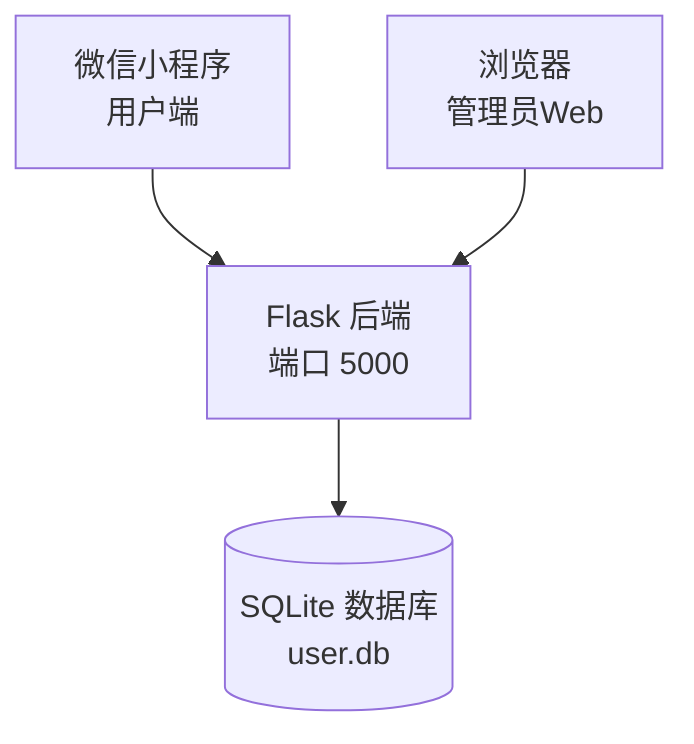

## 二、目录与运行约定

| 项目 | 约定 |
| :--- | :--- |
| 后端目录 | `class-checkin-wxapp/backend/` |
| 数据库文件 | `backend/user.db` |
| 日志输出 | 控制台（开发模式）/ 文件（生产模式） |
| 环境变量 | `backend/.env` 文件 |
| 备份文件 | `backup/user.db_YYYYMMDD` |

## 三、运维流程（最小集）

| 流程 | 动作 | 输出 |
| :--- | :--- | :--- |
| 启动 | `python app.py` | 服务启动在 http://0.0.0.0:5000 |
| 数据库初始化 | 运行 init_db.py | 创建所有表结构和索引 |
| 备份 | `cp user.db backup/user.db_$(date +%Y%m%d)` | 备份文件 |
| 数据恢复 | `cp backup/user.db_XXXXXX user.db` | 恢复数据库 |

# 九、约束与风险

## 一、当前约束

| 约束项 | 说明 |
| :--- | :--- |
| 存储介质 | SQLite 单文件，不支持高并发写入 |
| 架构形态 | 单体应用，无水平扩展能力 |
| 并发能力 | SQLite 文件锁限制同时写入数 |
| 鉴权方案 | JWT 无刷新机制，过期需重新登录 |
| 定位精度 | 依赖微信小程序 GPS 精度，可能有偏差 |
| 补卡时限 | 仅支持近 3 天内补卡申请 |

## 二、主要风险与缓解策略

| 风险 | 影响 | 缓解策略 |
| :--- | :--- | :--- |
| SQLite 并发写入 | 高并发时写入阻塞 | 限制打卡并发；后续可升级 PostgreSQL/MySQL |
| GPS 定位漂移 | 用户在范围内但定位偏差导致打卡失败 | 允许一定容差；围栏半径适当放大 |
| Token 泄露 | 账户被盗用 | 生产环境使用 HTTPS；定期更换密钥 |
| 密码过于简单 | 暴力破解风险 | 前端限制密码长度；后端限制登录失败次数 |
| 数据误删 | 用户数据不可恢复 | 使用软删除；定期备份 |
| 跨平台兼容 | 微信版本差异导致 API 不可用 | 检查 API 可用性；提供降级方案 |

## 三、演进建议（不影响当前 Demo）

1. **数据库升级**: 从 SQLite 迁移到 PostgreSQL/MySQL，支持高并发和更多功能
2. **鉴权升级**: 增加 Token 刷新机制，支持第三方登录
3. **消息推送**: 集成微信订阅消息，审批结果实时通知
4. **异步任务**: 打卡高峰时使用消息队列异步处理
5. **监控告警**: 增加接口耗时、错误率监控和告警
6. **数据分析**: 积累打卡数据后，可分析出勤率、迟到规律等
7. **人脸识别**: 增加人脸打卡功能，防止代打卡
